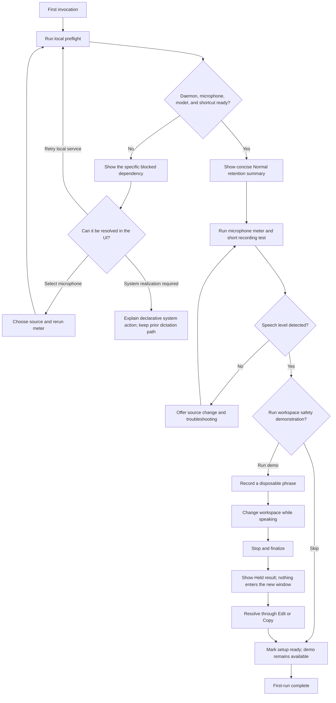
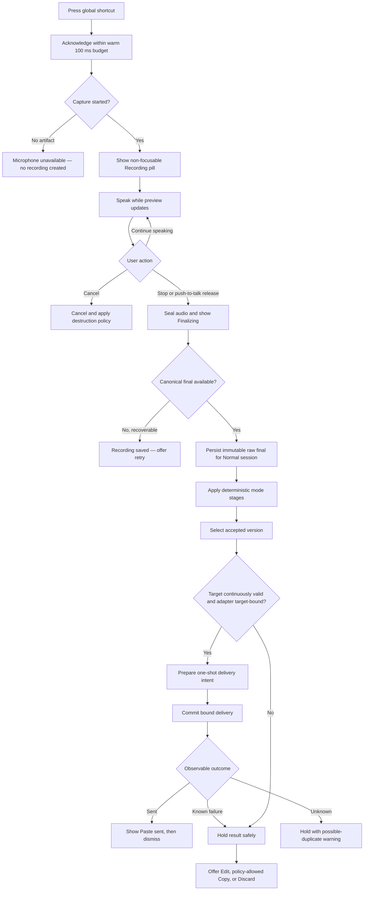
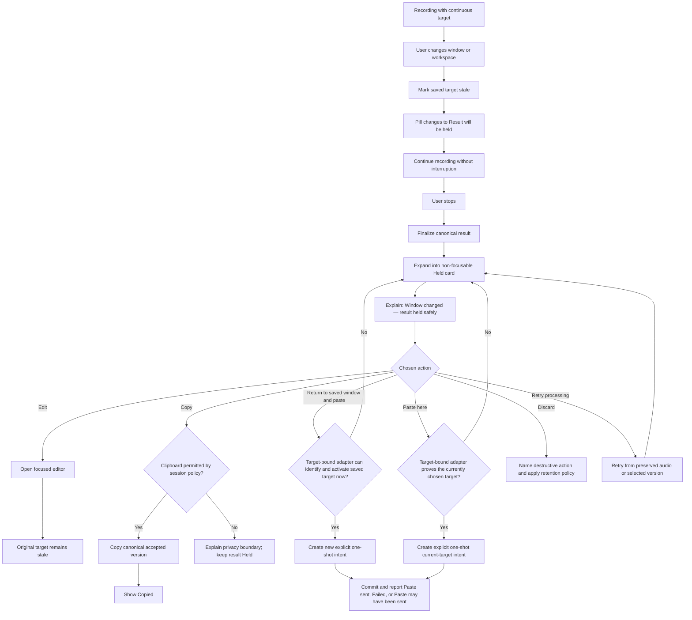
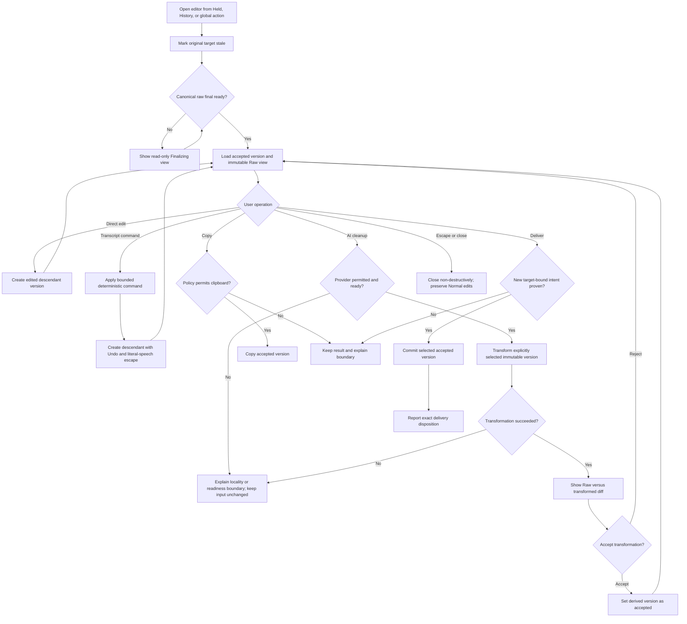
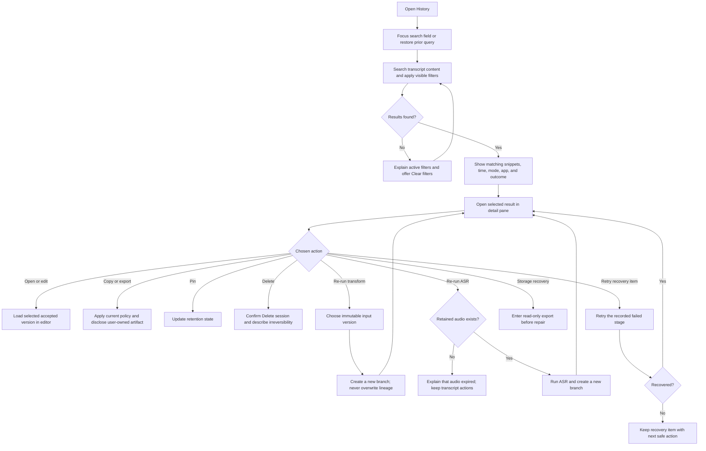
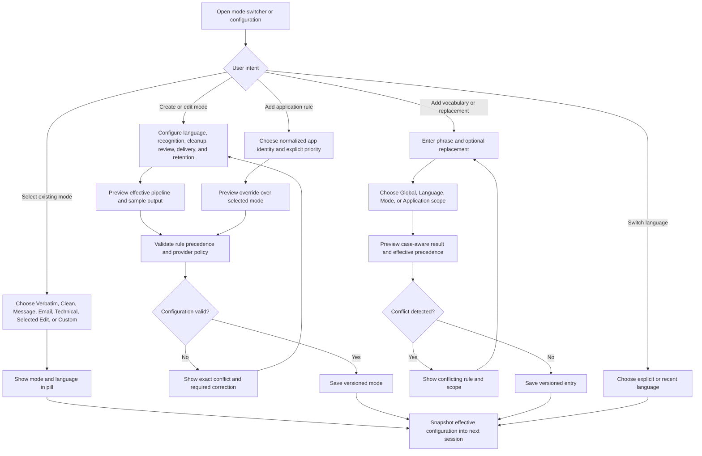
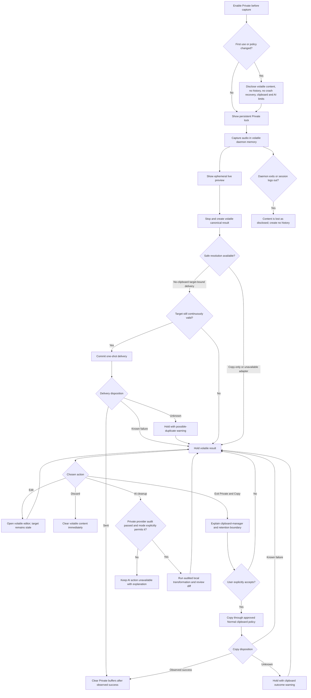
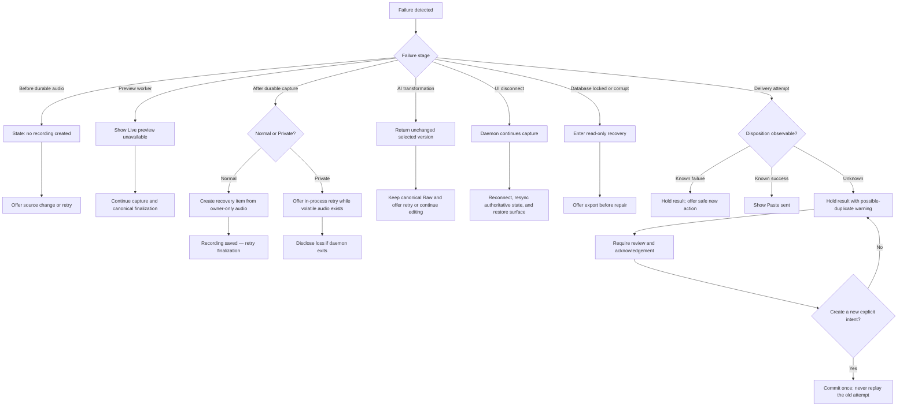

---
stepsCompleted:
  - 1
  - 2
  - 3
  - 4
  - 5
  - 6
  - 7
  - 8
  - 9
  - 10
  - 11
  - 12
  - 13
  - 14
inputDocuments:
  - docs/dictation/README.md
  - docs/dictation/architecture.md
  - docs/dictation/task-plan.md
  - docs/dictation/evidence/README.md
workflowType: ux-design
projectName: Dictation
userName: Carter
date: 2026-07-09
mobbinResearch: completed
supportingArtifacts:
  - docs/dictation/ux-design-directions.html
lastStep: 14
workflowStatus: complete
completedAt: 2026-07-09T23:02:28-06:00
designDirectionDecision:
  primary: "Paper & Margin"
  capture: "Quiet Orbit"
  history: "Paper & Margin list/detail"
  accelerator: "Command Strip"
  confirmedAt: 2026-07-10
---

# UX Design Specification — Dictation

**Author:** Carter
**Date:** 2026-07-09

---

## Executive Summary

### Project Vision

Dictation is a local-first Wayland desktop application that turns speech into a recoverable, editable draft before deliberately delivering it to another application.

The defining UX principle is separation between capture and delivery. Users can continue speaking while changing windows or workspaces without text following their focus. A compact, non-focus-stealing overlay communicates recording and transcription state; a focused editor handles review, correction, transformations, and delivery.

### Target Users

The documented primary user is a keyboard-first senior developer working across Niri and Hyprland who:

- Dictates messages, prose, Markdown, and technical language.
- Frequently changes windows and workspaces while transcription finishes.
- Expects predictable global shortcuts and minimal mouse dependence.
- Values local processing, inspectable behavior, recovery, and privacy.
- Needs vocabulary support for code, product names, and specialist terminology.

A possible later audience is privacy-conscious Linux/Wayland users, but the first design should optimize for Carter's daily workflow rather than generic consumer onboarding.

### Key Design Challenges

- Present live transcription without stealing focus or implying preview text is final.
- Communicate target safety—continuous, stale, lost, or unavailable—without exposing implementation jargon.
- Make recording, finalization, cleanup, review, and delivery feel like one coherent flow despite distinct system states.
- Support global keyboard actions when the mini overlay itself cannot receive input.
- Preserve confidence during failures, delayed finalization, unknown delivery outcomes, and recoverable sessions.
- Explain Normal versus Private behavior without burying users in retention mechanics.
- Scale from a tiny overlay to editor, history, modes, vocabulary, and settings without turning the product into a control-panel swamp.

### Design Opportunities

- A calm “speech cockpit” that shows only the information needed at each moment.
- Progressive disclosure: pill → result card → editor → history/details.
- Trustworthy delivery language: “Ready,” “Target changed,” “Copied,” or “Paste sent,” never vague success theater.
- Visually distinct preview, canonical, edited, and AI-derived text.
- Strong keyboard choreography with consistent global actions and Escape semantics.
- Modes that feel like lightweight intent presets rather than model configuration.
- Privacy indicators that are persistent but quiet, with explicit disclosure only when a boundary changes.
- Recovery UX that treats failures as resumable work rather than dead-end error dialogs.

## Core Experience Summary

### Defining Experience

The defining interaction is:

> Press a global shortcut, speak naturally, stop, and trust that the result will either reach the continuously valid target or wait safely for an explicit decision.

The core loop is:

1. **Invoke** — The global shortcut acknowledges recording immediately.
2. **Speak** — A non-focusable pill shows level, timer, and live preview.
3. **Continue working** — Changing windows or workspaces never causes text to follow focus.
4. **Stop** — The preview transitions clearly into canonical finalization.
5. **Resolve** — A safe target receives the accepted text, or the result becomes Held with Edit/Copy/Discard actions.
6. **Recover** — Every normal session either finishes or remains recoverable.

Opening the editor, choosing modes, searching history, and managing vocabulary support this loop; they must not burden ordinary dictation.

### Platform Strategy

- Native-feeling NixOS desktop experience built with Quickshell.
- Wayland-first support for Niri and both Hyprland configurations.
- Keyboard-first, with mouse interaction available in focused surfaces.
- The recording pill is a non-focusable layer-shell surface.
- Actions against the pill use compositor-global shortcuts.
- The editor, history, and settings are normal focusable surfaces.
- Local and offline operation is the default.
- Multi-monitor placement follows the active output.
- Fractional scaling, reduced motion, high contrast, scalable text, and AT-SPI semantics are first-class requirements.
- Unsupported compositor capabilities visibly degrade to Copy/Edit rather than pretending targeted delivery is safe.

### Effortless Interactions

- Recording acknowledges within roughly 100 ms.
- The current mode, language, microphone, and privacy policy persist until intentionally changed.
- The pill appears where the user is working without moving keyboard focus.
- Preview text updates naturally without demanding interaction.
- Stopping works through the same toggle or push-to-talk release.
- Canonical finalization requires no extra confirmation when nothing needs review.
- A focus change silently prevents automatic delivery and preserves the result.
- Held results expose only actions that are actually safe.
- The editor opens directly onto the current result with no navigation ceremony.
- Escape always has a predictable, non-destructive meaning.
- Copy, retry, edit, and discard remain available through global keyboard choreography.
- Raw text and version history remain accessible without competing with the accepted draft.

### Critical Success Moments

1. **Immediate acknowledgement**
   The user presses the shortcut and knows recording started before speaking.

2. **Safe workspace change**
   The user changes focus while talking or processing, and absolutely nothing is typed into the new application.

3. **Preview-to-final transition**
   The UI makes it obvious when text is provisional, finalizing, canonical, edited, or transformed.

4. **Unremarkable successful delivery**
   When an atomic target-bound adapter is available, it sends accepted text to the bound target and reports `Paste sent` without ceremony.

5. **Graceful held result**
   When delivery is unsafe, the transcript remains visible and actionable instead of disappearing or creating an alarming dialog.

6. **Failure recovery**
   A UI or model failure leads to a recoverable result with a clear next action.

7. **First-use proof**
   The first successful session demonstrates the entire value proposition: invoke, dictate, see live text, stop, and safely resolve the result.

### Experience Principles

1. **Capture now; resolve delivery safely.**
2. **Desktop focus is sacred.**
3. **Show the true system state—never confidence theater.**
4. **Keep the ordinary path quiet; reveal depth on demand.**
5. **Preview is useful but never authoritative.**
6. **Every global action must be predictable and reversible.**
7. **Failure should preserve work and present a next step.**
8. **Privacy boundaries must be legible at the moment they change.**
9. **Capability degradation must remain useful, never deceptive.**
10. **The UI should disappear from attention faster than the user's thought does.**

## Desired Emotional Response

### Primary Emotional Goals

The product should make the user feel:

- **In control** — Speech capture never creates unintended desktop actions.
- **Calm** — The interface communicates state without demanding attention.
- **Confident** — The user always knows whether text is previewing, finalizing, ready, held, copied, or sent.
- **Fast** — Invoking dictation feels closer to thinking aloud than operating software.
- **Protected** — Focus changes, failures, and privacy boundaries behave conservatively.
- **Capable** — Advanced modes and editing extend the user's workflow without making the core experience feel complicated.

The primary emotional promise is quiet confidence: “I can speak and keep working; this will not betray me.”

### Emotional Journey Mapping

| Moment | Desired feeling | UX response |
|---|---|---|
| First discovery | Curious but appropriately skeptical | Clearly explain local processing and safe delivery |
| First invocation | Immediate certainty | Instant visual/audio acknowledgement |
| Recording | Focused and unselfconscious | Quiet pill, stable timer, restrained level feedback |
| Live preview | Productive | Legible but visibly provisional text |
| Workspace change | Protected | No interruption; target state quietly becomes Held |
| Finalization | Informed patience | Short, explicit processing transition |
| Safe delivery | Effortless satisfaction | Brief confirmation with no ceremony |
| Held result | Still in control | Explain why and expose only safe actions |
| Editing | Capable | Direct access to draft, raw text, versions, and diff |
| Failure | Reassured rather than punished | Preserve work and present one clear recovery action |
| Returning later | Familiar and fast | Persistent modes, shortcuts, and predictable placement |

### Micro-Emotions

The most important micro-emotional transitions are:

- **Uncertainty → certainty** when recording begins.
- **Skepticism → trust** when changing workspaces causes no text leakage.
- **Impatience → informed waiting** during finalization.
- **Alarm → control** when a result becomes Held.
- **Fear of loss → relief** when recovery is available.
- **Cognitive load → fluency** as shortcuts become muscle memory.
- **Privacy concern → confidence** when Private behavior is stated precisely.

### Design Implications

- Recording feedback must appear before meaningful speech can begin.
- State labels must use plain language and never rely on color alone.
- The pill should feel present but peripheral—not like an incoming call banner.
- Preview text should appear lighter or softer than canonical text, then settle smoothly.
- Target changes should not trigger alarming warnings; the result simply becomes safely Held.
- Errors should lead with preserved work and the next action: “Recording saved — retry transcription.”
- Delivery confirmation should be restrained: a short state change or subtle check, never confetti.
- Private mode should remain visible but quiet until an action would cross its boundary.
- Unknown delivery outcomes require honest language: “Paste may have been sent. Review before retrying.”
- Destructive actions need explicit wording and predictable focus behavior.
- Motion should communicate hierarchy using `cubic-bezier(.2,.8,.2,1)` and respect reduced motion.
- Sounds should be optional, short, non-verbal, and paired with visual equivalents.
- Red should be reserved for unrecoverable or blocking conditions—not ordinary recording.

### Emotional Design Principles

1. **Earn trust through conservative behavior.**
2. **Acknowledge immediately; explain only when necessary.**
3. **Prefer quiet satisfaction over theatrical delight.**
4. **Never make safe degradation feel like product failure.**
5. **Lead recovery messages with what was preserved.**
6. **Use motion to clarify state, not decorate waiting.**
7. **Make privacy boundaries visible before crossing them.**
8. **Never claim certainty the system cannot observe.**
9. **Keep the user's attention on their thought, not the tool.**

## UX Pattern Analysis & Inspiration

### Inspiring Products Analysis

#### Capture and recording

- [Otter's recording flow](https://mobbin.com/flows/d7a0fc7c-713c-40b5-bbc4-4447ba7e6a8f) proves the value of teaching first use inside the real recorder. Its transcript, timestamps, and anchored controls create continuity from capture to review. Dictation should borrow that continuity while removing meeting and collaboration furniture.
- [Krea AI's recorder](https://mobbin.com/screens/dd7edfc3-286b-4181-8f2c-090b31d451e3) exposes the selected microphone, elapsed time, cancel, and done actions in one compact state. These are the right facts, though Dictation should present them in a much smaller non-focusable surface.
- [Runway's recorder](https://mobbin.com/screens/6f3a7099-e53a-4c2f-b8c4-eb9ebd0f96a1) separates capture/playback from the final “Use this” commitment. That distinction maps well to Dictation's preview, canonical result, and deliberate delivery stages.
- [Descript's guided recording](https://mobbin.com/screens/62e9c82a-080e-48f9-8b75-db498528e1bc) demonstrates useful first-run coaching around recording setup. Its full-page treatment is appropriate for onboarding, not the ordinary dictation loop.

#### Editing and transformation

- [Grammarly's contextual suggestions](https://mobbin.com/screens/a09d861b-791e-4d00-98aa-72d1875b876d) keep the document visible, anchor feedback to highlighted text, and make accept/dismiss decisions local.
- [Grammarly's accept-suggestion flow](https://mobbin.com/flows/6523b98c-99a8-4b5b-b3f9-86fb4af806b6) removes intervention chrome after acceptance and returns attention to the document. Dictation should use the same “review, decide, disappear” rhythm for transformations and diffs.
- [Remote's writing side panel](https://mobbin.com/screens/f6ab68ea-04c0-41e2-905b-636d34db16ec) preserves the primary writing context while providing bounded assistance beside it. This supports a focused editor with secondary version and transformation tools, rather than modal editing.

#### Modes and voice controls

- [Grok's mode presets](https://mobbin.com/screens/b2e54454-4069-4cc2-9387-7af5039b8ea0) use simple cards plus custom instructions. The pattern makes a small preset set understandable without exposing model machinery.
- [Grammarly's voice settings](https://mobbin.com/screens/373843b6-21a6-42f4-8b80-9c8dda50bd0a) combine tone chips, profession, and language in recognizable controls. Dictation can adapt this to mode intent, language, formatting, and vocabulary scope.
- [WRITER's voice configuration](https://mobbin.com/screens/7d7ca8ad-51df-49bb-ad0c-b441b6565c6d) provides immediate preview of changes. Its large trait matrix is too heavy, but live preview is valuable when authoring or editing a custom mode.

#### History and retrieval

- [Grain's transcript search](https://mobbin.com/screens/d62c96ac-7aff-44c4-b990-f4a340aaa740) returns matching snippets with timestamps, allowing recognition before opening a result. Dictation history should similarly search transcript content and surface the matching line.
- [ElevenLabs' history](https://mobbin.com/screens/9369bd47-0cec-4ff6-bc1e-0e087830e574) combines search, filters, status, and a clear result list without hiding retrieval behind navigation.
- [ElevenLabs' filtered empty state](https://mobbin.com/screens/9cb47e01-23d2-4d88-9cf4-da49f3b9e7ec) explains why no results appear and offers a direct clear-filters recovery action. This is preferable to a generic “nothing here” message.

#### Vocabulary and setup

- [Dovetail's vocabulary entry](https://mobbin.com/screens/34bed79a-c649-4d8e-827f-3ecfca959aaa) pairs a direct term-entry field with a short explanation of the feature.
- [Dovetail's scoped vocabulary](https://mobbin.com/screens/dd10f540-8580-4e35-b74b-dde2ad79d703) makes scope explicit. Dictation should adapt this to Global, Mode, and optional Application scopes.
- [Otter's vocabulary list](https://mobbin.com/screens/b5cf9545-222d-4746-bc4c-c87a723fa020) demonstrates the value of a plain, searchable custom-word inventory, though upgrade prompts have no place in this local tool.
- [Fireflies' vocabulary settings](https://mobbin.com/screens/ece6bb28-1f05-4d98-9b67-6dddff806a43) reinforce the usefulness of scope-like organization, but also show the SaaS administration weight to avoid.

Direct Mobbin searches did not surface Superwhisper or Wispr Flow. These references are therefore adjacent products and transferable interaction evidence, not claims that Dictation reproduces either product's implementation.

### Transferable UX Patterns

#### Surface hierarchy

1. **Recording pill** — Non-focusable, peripheral, and limited to state, level, timer, provisional text, mode, and privacy.
2. **Held result card** — Appears when automatic delivery is unsafe; preserves context and offers Edit, Copy, Retry, or Discard.
3. **Editor** — A normal focusable window for canonical text, raw text, transformations, diffs, and versions.
4. **History** — Search-first retrieval with transcript snippets, time, mode, outcome, privacy state, and recovery status.
5. **Settings** — A focused configuration surface for shortcuts, microphones, languages, modes, vocabulary, privacy, and retention.

#### Interaction patterns

- Teach the first recording inside the real capture flow.
- Keep the user's text visible while presenting edits or transformations.
- Anchor changes to the affected text and make accept/reject decisions local.
- Use preset cards for common modes and progressive disclosure for custom instructions.
- Preview a custom mode against sample text before saving it.
- Search transcript content, not only titles or metadata.
- Return matching snippets and highlight the query in context.
- Make active filters visible and provide a one-action reset.
- Add vocabulary through a single direct field, then assign scope only when needed.
- Preserve user work before explaining failure or asking for recovery input.

#### Visual patterns

- Use a restrained, low-chrome pill rather than a modal recording canvas.
- Reserve strong color for state changes that require action.
- Distinguish provisional and canonical text through typography and motion, not color alone.
- Use compact status chips for mode, privacy, Held state, and filters.
- Keep editor intervention chrome adjacent to the text and remove it after resolution.
- Prefer searchable lists and contextual drawers over dashboard card grids for information-dense secondary surfaces.

### Anti-Patterns to Avoid

- Focus-stealing recording modals for the ordinary capture path.
- Oversized waveforms that consume space without helping the user decide anything.
- Red “emergency” recording treatment for a normal active state.
- Long account-style onboarding before the first useful recording.
- Persistent SaaS sidebars, team administration, collaboration, and upgrade furniture.
- AI quality scores or opaque confidence theater.
- Dense history tables optimized for administrators rather than transcript recognition.
- Huge personality or tone matrices for mode configuration.
- State communicated only through color, animation, or sound.
- Generic success messages that do not distinguish copied, sent, held, or unknown outcomes.
- Disabled controls without an explanation or recovery path.
- Patterns that imply exact caret insertion or continuous target ownership when the compositor cannot guarantee it.

### Inspiration Strategy

#### Adopt

- Otter's continuity from real recording into transcript review.
- Grammarly's contextual, reversible edit decisions.
- Grain's transcript-snippet search results.
- ElevenLabs' filter visibility and recoverable empty states.
- Dovetail's direct vocabulary entry and explicit scope.
- Grok's small set of understandable mode presets plus custom instructions.

#### Adapt

- Convert mobile and web recorder canvases into a desktop, non-focus-stealing pill.
- Convert writing suggestions into Raw, Diff, and Versions views inside the editor.
- Replace meeting metadata with dictation metadata: time, mode, application, outcome, language, and privacy policy.
- Translate vocabulary workspaces into Global, Mode, and optional Application scopes.
- Reduce guided onboarding to a local microphone test and one real dictation.

#### Avoid

- Large capture canvases, meeting-centric features, collaboration furniture, and account funnels.
- Generic “AI” gradients, decorative sparkle, or anthropomorphic assistant behavior.
- Full-screen treatment for settings used during an ordinary session.
- Any visual pattern that overstates the reliability of target binding or delivery confirmation.

## Design System Foundation

### Design System Choice

Dictation will use a **themeable native QML design system built as a focused extension of the existing `qs-shell` system**.

The foundation combines:

- Existing `qs-shell` color, surface, geometry, and reduced-motion conventions.
- Raw QtQuick primitives for the non-focusable layer-shell recording surface.
- Qt Quick Controls behavior primitives, where appropriate, for keyboard, focus, selection, scrolling, and accessibility in focused windows.
- Dictation-specific semantic tokens and reusable components.
- A thin compatibility boundary so Dictation can run under Hyprland, Niri, and sessions where the full `qs-shell` process is not active.

This is a hybrid themeable-system approach: existing visual foundations are reused, while product-specific components remain custom.

### Rationale for Selection

#### Native platform fit

The defining interface is not a conventional application window. It includes a non-focusable layer-shell pill, compositor-global actions, active-output placement, and focused editor/history surfaces. Raw QML control over window and input behavior is therefore essential.

A web-oriented design system does not apply, while adopting Qt Quick Controls' default Material or Universal appearance would conflict with the surrounding desktop and still require extensive custom work.

#### Existing visual foundation

The current `qs-shell` system already establishes:

- Nine base theme colors with derived tonal, panel, glass, outline, and glow colors.
- Dark and light theme variants.
- Umbra as the signature graphite-and-coral visual direction.
- Consistent radii and capsule geometry.
- Shared animation durations and reduced-motion behavior.
- Existing capsule, panel, OSD, overlay, and popout patterns.

Dictation should feel like a native capability of this desktop rather than a visually unrelated application.

#### Delivery speed

The initial implementation is expected to be driven by one senior developer over an 8–10 working-day integrated-proof window. Extending proven primitives is substantially more practical than creating a comprehensive component library or porting a large established system. The broader daily-driver Alpha remains a 12–18 working-day effort.

The component system should grow only when a repeated Dictation interaction requires it.

#### Product-specific requirements

The existing shell tokens are necessary but insufficient for:

- Provisional versus canonical transcript typography.
- Recording, finalizing, ready, held, private, recoverable-error, and delivery-unknown states.
- Editable transcript and immutable raw-version presentation.
- Diffs, versions, history search, vocabulary, modes, and microphone testing.
- Strong keyboard focus treatment.
- Scalable editor typography.
- Screen-reader semantics and throttled live-region announcements.
- High-contrast behavior independent of the selected color theme.

These capabilities belong in a small Dictation-specific semantic layer.

### Implementation Approach

#### Foundation layer

Create a `Dictation.Design` QML module containing:

- `DictationTheme.qml` — maps the active shell palette into Dictation semantic colors.
- `DictationStyle.qml` — spacing, radii, typography, target sizes, borders, elevation, and motion.
- `DictationIcons.qml` or a small icon asset contract.
- Shared focus-ring and accessibility helpers.
- A standalone fallback palette matching Umbra when the shell theme provider is unavailable.

The application must consume palette values through this boundary rather than importing mutable internal shell components throughout the UI.

#### Semantic state tokens

Define named tokens for:

- `recording`
- `finalizing`
- `ready`
- `held`
- `recoverableError`
- `blockingError`
- `privateMode`
- `deliveryUnknown`
- `previewText`
- `canonicalText`
- `diffInsertion`
- `diffDeletion`
- `selection`
- `focusRing`

Every semantic state must also have a text label and/or icon. Color is supporting information, never the only indicator.

#### Typography

Extend the shell's compact type scale with application typography suitable for longer text:

- UI caption and metadata.
- UI label and button text.
- Body text.
- Transcript preview.
- Editor text.
- Section headings.
- Monospace metadata, timestamps, shortcut hints, and technical vocabulary.

Transcript and editor sizes must follow the user's text-scaling preference rather than inheriting a fixed shell-widget size.

#### Motion

Dictation motion should use calm, non-overshooting transitions:

- Fast acknowledgement: approximately 100–140 ms.
- Standard state transition: approximately 180–280 ms.
- Surface expansion: approximately 240–320 ms.
- Easing: `cubic-bezier(.2,.8,.2,1)` or its QML equivalent.
- Reduced motion: state changes remain legible with effectively immediate transitions.

The existing overshooting `Style.pop` motion should not be used for recording, delivery, errors, or privacy changes.

#### Initial component set

Build only the reusable components required by planned flows:

- `CapturePill`
- `AudioLevelMeter`
- `RecordingTimer`
- `StateBadge`
- `PrivacyBadge`
- `ProvisionalTranscript`
- `TargetSafetyIndicator`
- `HeldResultCard`
- `GlobalCommandHint`
- `TranscriptEditor`
- `VersionSelector`
- `TranscriptDiff`
- `TransformationAction`
- `HistorySearchField`
- `HistoryResultRow`
- `FilterChip`
- `ModeCard`
- `VocabularyRow`
- `MicrophoneSelector`
- `MicrophoneTest`
- `RecoveryNotice`
- `DeliveryOutcomeNotice`
- `ConfirmationDialog`

Components should represent user-understandable concepts rather than mirror daemon implementation types.

#### Accessibility contract

Reusable components must provide:

- Explicit QML accessibility roles, names, descriptions, and states.
- Visible keyboard focus indicators with sufficient contrast.
- Logical focus order in every focused surface.
- Keyboard equivalents for pointer actions.
- Text and icon reinforcement for status colors.
- Scalable text without clipped controls.
- High-contrast variants.
- Reduced-motion support.
- Throttled announcements for meaningful state transitions, never every partial transcript update.

### Customization Strategy

#### Preserve the shell identity

Reuse the active shell's:

- Base palette and theme family.
- Panel and glass treatment.
- Outline language.
- Corner-radius family.
- Compact spacing rhythm.
- General fast-in/soft-out motion character.

The recording pill should look related to the existing OSD and capsule components while remaining visually distinct enough to communicate that recording is persistent.

#### Add a semantic Dictation layer

Do not bind product state directly to palette names such as `accent`, `r2`, or `r3`. Map palette colors to semantic roles so themes can change without altering the meaning of recording, Held, Private, or error states.

#### Support multiple host sessions

Dictation must not require the full `qs-shell` process to be running. The visual layer should support:

1. Active `qs-shell` theme integration when available.
2. A standalone Umbra-compatible fallback.
3. A high-contrast override.
4. Future mapping to another session theme without rewriting components.

#### Progressive component maturity

Components should progress through three levels:

1. Local component for a single screen.
2. Shared Dictation component after the second real use.
3. General shell primitive only when it is demonstrably useful outside Dictation.

This prevents the Alpha from becoming an accidental design-system rewrite.

## Detailed Core Experience

### Defining Experience

Dictation's defining experience is **safe roaming dictation**:

> Invoke dictation, speak naturally, continue using any window or workspace, and receive an app-owned result that is delivered only when its destination remains provably safe.

The short product description is:

> “I press a key, talk, and keep working. It never types into the wrong app.”

The product succeeds when speech capture feels ambient but delivery remains deliberate. The recording surface follows the user only as a status display; the transcript itself does not follow desktop focus.

The defining distinction is:

- **Capture belongs to Dictation.**
- **Preview remains provisional.**
- **The original destination is remembered but never blindly trusted.**
- **Delivery is a separate, guarded operation.**

If target safety can be proven continuously and the adapter can bind delivery atomically to that target, the result may be delivered automatically. Otherwise, Dictation preserves it as a Held result with safe next actions.

### User Mental Model

#### Mental models users already bring

Users generally approach desktop dictation with one of three expectations:

1. **Voice keyboard** — Speech is typed wherever the caret currently exists.
2. **Voice recorder** — Speech is captured inside an application and reviewed later.
3. **Clipboard draft** — Speech produces text that the user manually places somewhere else.

The current hotkey implementation encourages the voice-keyboard model. That is convenient until focus changes, at which point the same model becomes dangerous.

Dictation intentionally combines the familiar parts of all three:

- A global hotkey starts capture like a voice keyboard.
- A persistent recording pill behaves like a compact recorder.
- An app-owned draft provides the safety of a clipboard workflow.
- A remembered destination permits low-friction delivery when safety can actually be proven.

The preferred mental model is:

> **A voice draft with a remembered destination.**

#### What each surface means

- The **recording pill** is an instrument panel. It reports capture state but is not the text destination.
- The **live transcript** is comparable to live captions. It is useful but replaceable.
- The **canonical result** is the first authoritative transcript.
- The **Held result** means the text is safe, but its destination is no longer safe enough for automatic delivery.
- The **editor** is an intentional workspace for changing the canonical result or creating derived versions.
- **History** is recovery and retrieval, not an inbox that must be managed.

#### Likely points of confusion

Users may incorrectly assume:

- Text shown in the pill has already been inserted elsewhere.
- Stable-looking preview words are canonical.
- Returning to the original window restores delivery safety.
- The currently focused window automatically becomes the new destination.
- Opening the editor preserves the original insertion target.
- “Sent,” “Copied,” and “Paste may have been sent” mean the same thing.
- Private mode is merely a visual label rather than a different artifact policy.

The UI must resolve these misunderstandings through behavior and plain-language states rather than technical explanations.

#### Teaching the model

First-use onboarding should demonstrate the safety promise inside a real recording:

1. Start a dictation from a disposable text field.
2. Speak a short phrase.
3. Change workspace while recording.
4. Stop recording.
5. Observe that no text appears in the newly focused application.
6. Resolve the Held result through Edit or Copy.

This single exercise teaches the product's novel behavior more effectively than a sequence of introductory slides.

### Success Criteria

The core experience “just works” when all of the following are true.

#### Invocation and capture

- Warm command acknowledgement p95 is below 100 ms.
- The recording pill appears before the user reasonably begins speaking.
- Optional audio acknowledgement agrees with the visual state.
- Duplicate or repeated hotkey events never create duplicate sessions.
- Push-to-talk starts only from a proven press and stops on its matching release.
- A setup failure clearly states whether any audio artifact exists.

#### Live feedback

- Warm visible preview p95 is at or below 900 ms after speech begins.
- The pill remains peripheral and never steals keyboard focus.
- Audio level, timer, recording state, mode, language, and privacy state remain legible at a glance.
- Preview text visually distinguishes more stable content from replaceable partial content.
- Partial transcript updates never produce noisy screen-reader announcements.
- Preview text is never persisted, transformed, copied, or delivered.

#### Focus and target safety

- Changing windows or workspaces causes zero unintended text insertion.
- Desktop focus never silently redefines the delivery target.
- Returning to the original application does not manufacture certainty the system cannot prove.
- A monitoring gap or closed target degrades to Held.
- Opening the focused editor intentionally marks the original target stale.
- Unsupported delivery environments expose Copy/Edit rather than a misleading Paste action.

#### Finalization

- Stopping produces an immediate, visible transition from Recording to Finalizing.
- The user never needs to press Save merely to preserve an ordinary recording.
- Every normal session after durable audio begins produces canonical text or recoverable audio unless explicitly cancelled or discarded.
- Canonical text replaces provisional preview with a clear but restrained transition.
- Editing remains unavailable until a canonical result exists.

#### Resolution and delivery

- Proven safe delivery requires no unnecessary confirmation.
- Unsafe delivery produces a Held result rather than an error or best-effort paste.
- Held results expose a clear safe action: Edit, Copy, Retry, or Discard.
- Delivery outcomes use precise language: Paste sent, Copied, Held, or Paste may have been sent.
- An unknown delivery attempt is never replayed automatically.
- Recoverable failures lead with what was preserved.
- Every core journey is possible from the keyboard.

#### User comprehension

After the first successful session, the user should be able to explain:

- Why they can change workspaces safely.
- Why live preview may change after stopping.
- What Held means.
- Whether the result was sent, copied, or merely preserved.
- Where to recover a normal result later.
- What Private mode will and will not retain.

### Novel UX Patterns

#### Established patterns

Dictation can rely on familiar conventions for:

- Global shortcut invocation.
- Push-to-talk and toggle recording.
- Timer and microphone-level feedback.
- Live-caption-style transcript updates.
- Searchable history.
- Text editing, undo/redo, and diffs.
- Mode presets and vocabulary lists.
- Status badges and recoverable notices.

These patterns should behave conventionally so the safety model receives the user's limited learning attention.

#### Novel combination

The novel interaction is the combination of:

- A streaming but non-focusable desktop overlay.
- An app-owned draft rather than direct continuous typing.
- A destination captured at invocation.
- Continuous target-safety evaluation.
- Delivery separated from capture.
- Conservative Held behavior when certainty is lost.

Individual pieces are familiar; their safety relationship is not.

#### Teaching strategy

The product should teach the model through consequences:

- When focus remains safe, resolution is quiet.
- When focus changes, the text visibly remains with Dictation.
- Held is presented as successful preservation, not failure.
- The result card explains the immediate reason in plain language: “Window changed — result held safely.”
- Only actions valid in the current environment appear.
- Preview visibly settles into canonical text after stopping.

Implementation terms such as target identity, adapter capability, monitoring gaps, and version IDs must remain outside ordinary UI copy.

### Experience Mechanics

#### 1. Initiation

The primary global shortcut toggles recording. An optional second binding provides push-to-talk.

On invocation, Dictation:

1. Accepts or idempotently rejects the command.
2. Captures the current delivery intent and available target evidence.
3. Begins durable audio capture.
4. Presents the recording pill on the active output.
5. Shows `Recording` immediately.
6. Starts the timer and microphone-level feedback.
7. Emits the optional start sound when enabled.

The pill must not acquire keyboard focus or change the active workspace.

If capture cannot begin, the pill becomes a concise failure notice:

- `Microphone unavailable — no recording created`
- `Model unavailable — recording can still be saved`, when recovery is possible

#### 2. Recording interaction

While speaking, the user may continue navigating the desktop normally.

The pill displays:

- Recording state.
- Elapsed time.
- Restrained audio-level feedback.
- Stable and replaceable preview text.
- Current mode and language.
- Private status when active.
- A compact destination state such as `Target ready` or `Result will be held`.

The destination indicator changes quietly when safety changes. It must not interrupt speech with a modal warning.

Preview behavior:

- Replaceable words remain visually softer.
- Stable preview words become more legible but remain clearly provisional.
- The transcript uses a bounded number of lines.
- Older preview text scrolls or elides without resizing the pill unpredictably.
- The preview never accepts editing or selection.

Global commands remain available for:

- Stop.
- Cancel.
- Open the read-only expanded view.
- Hide/show the pill without stopping capture.

Opening an expanded surface intentionally acquires focus and makes automatic delivery to the original target ineligible unless a later explicit target-bound intent is proven.

#### 3. Stopping and finalization

The user stops with the same toggle shortcut or releases push-to-talk.

The pill immediately transitions:

1. Microphone-level motion ends.
2. `Recording` becomes `Finalizing`.
3. The timer stops.
4. Preview remains visible but read-only.
5. A restrained progress treatment indicates work without fabricating a percentage.
6. Canonical finalization consumes the sealed audio.

When canonical text becomes available:

- Replaceable preview is removed.
- Canonical text settles into place.
- Deterministic cleanup may run automatically against versioned canonical input and produce a new accepted version.
- A selected deterministic mode transformation may also run automatically when its contract does not require review.
- A generative transformation creates a pending derived version. The session becomes Held with `Review required`; that version cannot enter delivery until the user explicitly accepts it.
- Only canonical or deterministic, non-review output becomes Ready automatically.
- The system selects a safe resolution branch only after an accepted version exists.

#### 4. Resolution branches

##### Safe automatic delivery

This path exists only when a target-bound adapter can atomically deliver to the continuously valid saved target.

1. Dictation prepares a one-shot delivery intent.
2. The pill shows `Delivering`.
3. The adapter performs the bound insertion.
4. An observable success produces `Paste sent`.
5. The confirmation remains briefly, then the pill dismisses.

No generic focus-based keystroke injection qualifies for this path.

##### Held result

A result becomes Held when:

- Focus or workspace changed.
- The target closed.
- Target monitoring was interrupted.
- The editor was opened.
- The compositor or application lacks a safe delivery adapter.
- Delivery failed with a known non-destructive outcome.

The pill expands into a restrained result card without stealing keyboard focus:

- `Window changed — result held safely`
- Canonical transcript excerpt.
- Edit, Copy, Retry, and Discard actions when allowed.
- Global shortcut hints for the primary actions.

Choosing Edit opens the focused editor. Choosing Copy reports `Copied`. Discard follows the applicable retention policy.

##### Recoverable failure

When finalization fails after audio was durably captured:

- Lead with preservation: `Recording saved`.
- Explain the failed stage in plain language.
- Offer Retry, alternate finalizer when supported, or Discard.
- Allow Edit or Copy only when canonical text exists.
- Keep the recovery item available after UI restart in Normal mode.

##### Unknown delivery outcome

If the process dies or observability is lost around an external delivery side effect:

- Preserve the result as Held.
- State: `Paste may have been sent — review before retrying`.
- Do not expose a one-key automatic retry.
- Require acknowledgement and a new explicit delivery intent.
- Warn about possible duplication without claiming failure or success.

#### 5. Completion

A session is visibly complete only when it reaches a precise outcome:

- `Paste sent`
- `Copied`
- `Held`
- `Recording saved — action needed`
- `Cancelled`
- `Discarded`

Successful transient confirmations dismiss automatically. Held and recoverable results remain accessible until resolved.

Normal sessions follow configured history and retention policy. Private sessions disclose their volatile behavior and leave no ordinary history entry.

The next invocation always begins a new session rather than silently appending to the previous transcript.

## Visual Design Foundation

### Color System

#### Brand foundation

Dictation inherits the `qs-shell` Umbra identity:

- Neutral graphite surfaces.
- Coral signature accent.
- Periwinkle secondary accent.
- Green positive state.
- Amber attention state.
- Soft-solid glass for transient desktop surfaces.
- Calm, high-contrast text with restrained decorative color.

Umbra is the reference theme for design and acceptance screenshots. Other installed shell themes remain supported through semantic token mapping, but they must pass the same contrast and state-recognition tests before being considered complete.

#### Base Umbra palette

| Base role | Dark | Light |
|---|---:|---:|
| Canvas | `#15171c` | `#f1f2f4` |
| Primary text | `#e6e9ef` | `#23262d` |
| Secondary text | `#a8afbd` | `#4b5059` |
| Faint/decorative | `#6b7280` | `#8a8f99` |
| Signature coral | `#ff7863` | `#e0523c` |
| On coral | `#1c0f0b` | `#ffffff` |
| Periwinkle | `#8ea7ff` | `#4a63cf` |
| Green | `#5fd4a2` | `#1e9e6e` |
| Amber | `#ffc46b` | `#c07b1f` |

The existing palette remains the source for theme identity. Dictation adds accessible strong variants where the base color is insufficient for normal-sized text.

#### Semantic color roles

| Semantic role | Dark reference | Light reference | Primary use |
|---|---:|---:|---|
| `textPrimary` | `#e6e9ef` | `#23262d` | Canonical transcript and primary labels |
| `textSecondary` | `#a8afbd` | `#4b5059` | Metadata and provisional transcript |
| `textDecorative` | `#6b7280` | `#8a8f99` | Dividers, inactive decoration; not normal text |
| `recording` | `#ff7863` | `#bd3d2c` | Recording state and stop action |
| `processing` | `#8ea7ff` | `#4a63cf` | Finalizing and transformations |
| `ready` | `#5fd4a2` | `#147a52` | Ready and observable delivery success |
| `held` | `#ffc46b` | `#89530d` | Safely preserved result requiring action |
| `error` | `#ff6b7a` | `#b53448` | Blocking or unrecoverable failure |
| `private` | `#8ea7ff` | `#4a63cf` | Private-mode boundary, always paired with lock and label |
| `deliveryUnknown` | Held/error combination | Held/error combination | Possible duplicate; always paired with explicit copy |
| `focusRing` | `#8ea7ff` | `#4a63cf` | Keyboard focus |
| `diffInsertion` | Green-derived | Green-derived | Added text |
| `diffDeletion` | Error-derived | Error-derived | Removed text |

State colors must be accompanied by a label, icon, shape, or placement difference. `Private`, `Processing`, and keyboard focus may share a hue because their forms and locations differ; they must never be represented by an unlabeled color dot.

#### Contrast behavior

Reference Umbra contrast against its canvas:

- Dark primary text: approximately `14.74:1`.
- Dark secondary text: approximately `8.14:1`.
- Light primary text: approximately `13.52:1`.
- Light secondary text: approximately `7.24:1`.
- Dark recording: approximately `6.93:1`.
- Light recording strong variant: approximately `4.85:1`.
- Dark processing: approximately `7.79:1`.
- Light processing: approximately `4.71:1`.
- Dark ready: approximately `9.76:1`.
- Light ready strong variant: approximately `4.76:1`.
- Dark held: approximately `11.41:1`.
- Light held strong variant: approximately `5.67:1`.

The existing `inkFaint` colors and light signature coral do not meet normal-text contrast in every combination. Therefore:

- Provisional text uses `textSecondary`, not reduced-opacity primary text.
- `textDecorative` is restricted to nonessential decoration or sufficiently large text.
- Small filled controls in light mode use the darker recording variant.
- Every foreground/background pair is tested after compositing, not merely as isolated token values.

#### Surface hierarchy

Define distinct surface roles:

- `surfaceGlass` — transient pill, OSD, and result-card material.
- `surfaceSolid` — editor, history, settings, and long-form reading.
- `surfaceRaised` — menus, drawers, diff panels, and selected rows.
- `surfaceInteractive` — buttons, chips, fields, and hoverable rows.
- `surfaceScrim` — modal or destructive-confirmation background.

Blur is decorative. Glass surfaces must retain sufficient opacity and an outline when compositor blur is absent, disabled, or visually noisy.

Long-form transcript and editor surfaces use opaque or nearly opaque backgrounds. High-contrast mode removes transparency and blur entirely.

#### State restraint

- Coral identifies active recording but should not flood the entire pill.
- Red is reserved for blocking or destructive states.
- Held uses amber as a safe attention state, not an alarm.
- Ready and successful delivery use green briefly.
- Processing uses periwinkle rather than recording coral.
- Private mode remains persistent but visually quiet.
- Unknown delivery combines an attention icon, precise label, and guarded action instead of relying on a more alarming color.

### Typography System

#### Typeface selection

Dictation uses fonts already installed declaratively on the system:

- **Primary UI and transcript:** `Noto Sans`
- **Technical and fixed-width metadata:** `JetBrainsMono Nerd Font`
- **Emoji fallback:** `Noto Color Emoji`

Noto Sans is used for all prose and editable transcripts. JetBrains Mono is limited to:

- Timestamps.
- Keyboard shortcuts.
- Mode identifiers where appropriate.
- Model and diagnostic metadata.
- Code-like protected terms.
- Diff line metadata.

The transcript itself must not default to monospace. Dictated prose deserves prose typography; the terminal has enough territory already.

#### Type scale

Sizes are logical pixels at 1× and are multiplied by system scaling and the user's text-scale preference.

| Token | Size / line height | Weight | Use |
|---|---:|---:|---|
| `typeMicro` | `11 / 16` | 500 | Shortcuts, timer, compact metadata |
| `typeLabel` | `12.5 / 18` | 500–600 | Buttons, chips, state labels |
| `typeBody` | `14 / 20` | 400 | Settings, history metadata, notices |
| `typePreview` | `15 / 21` | 400–500 | Live provisional transcript |
| `typeEditor` | `17 / 26` | 400 | Editable transcript and raw text |
| `typeSection` | `18 / 24` | 600 | Editor and settings section headings |
| `typeTitle` | `22 / 28` | 600 | Focused-window titles |
| `typeDisplay` | `28 / 34` | 600 | Rare onboarding or empty-state headline |

#### Transcript hierarchy

- Canonical text uses primary text color and normal weight.
- Replaceable preview uses secondary color.
- Stable preview may use medium weight but remains labeled or grouped as Preview.
- Selection uses the platform selection model with an accessible custom background.
- Raw transcript uses the same readable typeface as accepted text.
- Diff presentation uses background, marker, and text treatment rather than red/green text alone.
- Long passages target approximately `65–85` characters per line.
- Paragraph spacing is at least one half-line.
- Headings use sentence case.
- All-caps text is limited to very short optional badges and is never required for comprehension.

#### Scaling and localization

- Provide user text scaling from 100% through 200%.
- Verify the recording pill, Held card, editor, history, and settings at 200%.
- Prefer content-driven height and elision over clipped text.
- Never encode status in truncated trailing words.
- Allow longer translated labels without fixed-width assumptions.
- Use tabular figures for timers and aligned numerical metadata where available.

### Spacing & Layout Foundation

#### Spacing scale

Use a 4-pixel base grid with named tokens:

| Token | Value | Typical use |
|---|---:|---|
| `space1` | `4` | Icon/text optical adjustment |
| `space2` | `8` | Tight inline groups |
| `space3` | `12` | Compact control padding |
| `space4` | `16` | Standard component gap |
| `space5` | `24` | Section padding |
| `space6` | `32` | Major region separation |
| `space7` | `40` | Large surface inset |
| `space8` | `48` | Page-level separation |

Exceptions must be optical corrections inside components, not new unofficial spacing tokens.

#### Geometry

Reuse the shell radius family:

- `12` — controls, fields, compact rows.
- `16` — cards, menus, and small panels.
- `20` — Held cards and major floating surfaces.
- Half component height — recording pills and compact status capsules.

Borders are normally one logical pixel. Keyboard focus uses a two-pixel visible ring with separation from the component edge.

#### Density

The product should feel compact and efficient without becoming a status-dashboard thicket.

- Small icon controls: minimum `32 × 32`.
- Standard controls: minimum `36` logical pixels high.
- Primary actions and text fields: approximately `40` logical pixels high.
- Search and editor toolbar rows: `40–44` logical pixels high.
- History results: content-driven, normally `64–84` logical pixels high.
- Adjacent pointer targets retain at least `4–8` logical pixels of separation.
- Text-bearing controls grow vertically under text scaling.

The non-focusable pill may be denser than the editor because it is read-only and globally controlled. Destructive actions must not be packed directly beside the default action without separation.

#### Surface layout

##### Recording pill

- Bottom-center on the active output by default.
- Stable outer dimensions within each state.
- Bounded transcript region rather than unbounded vertical growth.
- State and timer occupy consistent positions.
- Level feedback remains compact and does not become the dominant visual.
- Mode, language, target safety, and privacy use progressive disclosure when width is constrained.

##### Held result card

- Expands from the pill's location without taking keyboard focus.
- Preserves the canonical transcript excerpt as the primary visual.
- Shows one sentence explaining why it was held.
- Places the safest likely action first.
- Separates Discard from Copy/Edit/Retry.
- Avoids wrapping shortcut hints into transcript content.

##### Focused editor

Use a content-first application layout:

- Compact top bar for session state and primary actions.
- Flexible central transcript column.
- Optional version/navigation rail.
- Contextual diff or transformation panel only when invoked.
- Maximum readable transcript width rather than edge-to-edge text.
- Secondary panels collapse into drawers at constrained widths.

##### History and settings

- Prefer searchable lists and list/detail layouts.
- Avoid dashboard card grids for transcript-heavy content.
- Keep filters close to search results.
- Preserve search position when opening and closing a session.
- Group settings by user intent rather than daemon subsystem.

#### Responsive behavior

Layouts respond to available logical width rather than named device classes:

- Pill metadata collapses before transcript readability is reduced.
- Editor side panels become drawers before the transcript column becomes too narrow.
- At narrow widths, secondary actions move into an overflow menu.
- At high text scale, toolbars may wrap into two stable rows.
- Each output independently respects fractional scaling and safe margins.
- Surface placement is recalculated when the active output changes.

### Accessibility Considerations

#### Visual access

- Normal text targets at least `4.5:1` contrast.
- Large text and essential non-text indicators target at least `3:1`.
- Keyboard focus has at least `3:1` contrast against adjacent colors.
- Contrast is measured after alpha compositing over the worst supported background.
- High-contrast mode uses opaque surfaces, stronger outlines, and no blur dependency.
- Provisional text remains readable; “provisional” must never mean “nearly invisible.”
- State, diff, and privacy information never rely on hue alone.

#### Keyboard access

- The pill receives no keyboard focus.
- Every pill action has a discoverable compositor-global equivalent.
- Focused surfaces use predictable Tab and Shift+Tab order.
- Arrow-key behavior follows established list, menu, tab, and text-editor conventions.
- Escape is contextual, predictable, and non-destructive.
- Focus returns to the invoking component when closing a child surface where possible.
- Destructive confirmation defaults to the safe action.

#### Assistive technology

- Use native QML text and controls for meaningful content rather than Canvas-rendered labels.
- Assign explicit accessible role, name, description, value, and state.
- Announce Recording, Finalizing, Ready, Held, failure, and completion.
- Do not announce every level-meter or partial-transcript update.
- Associate errors and help text with their controls.
- Expose transcript text as readable text, not a collection of decorative fragments.
- Give icon-only controls accessible names and visible tooltips.

#### Motion and sensory feedback

- Respect reduced motion across every surface.
- Remove travel, scale, and morph effects under reduced motion while retaining state changes.
- Avoid overshoot, bounce, flashing, and continuous decorative animation.
- Audio cues are optional and paired with visual state.
- Recording status never depends on audio feedback.
- Level feedback is smoothed and restrained rather than rapidly flickering.

#### Resilience

- UI remains understandable when blur, transparency, animation, sound, or one theme color is unavailable.
- At 200% text scaling, primary journeys remain complete without clipped actions.
- Missing icons fall back to text rather than blank controls.
- Unsupported delivery capability changes both copy and available actions.
- Errors lead with preserved work and expose a keyboard-operable recovery action.

## Design Direction Decision

### Design Directions Explored

The interactive comparison artifact is available at `docs/dictation/ux-design-directions.html`.

Seven structurally distinct directions were evaluated across Recording, Held result, Editor, and History states:

| Direction | Defining approach | Principal tradeoff |
|---|---|---|
| Quiet Orbit | One centered surface grows with task complexity | Morph stability under variable text |
| Edge Ledger | Persistent edge instrument and chronological spine | Narrow preview geometry and placement complexity |
| Command Strip | Keyboard-first command lens with minimal chrome | Discoverability |
| Paper & Margin | Document-first editor with contextual margin | Less literal visual continuity with the shell |
| Session Split | Persistent history beside the current result | Can make ordinary dictation feel administrative |
| Morph Dock | Bottom transport surface unfolding into focused work | Can overemphasize audio and dominate small outputs |
| Bare Signal | Typographic state with almost no containers | Wallpaper contrast and hidden affordances |

The directions differ in information hierarchy, surface placement, navigation, density, and interaction model—not merely color treatment.

### Chosen Direction

The selected direction is **Paper & Margin**, with Quiet Orbit retained as the compact capture primitive and Command Strip retained as an optional expert accelerator. Carter confirmed this direction on 2026-07-10.

#### Capture and finalization

Use Quiet Orbit only for the peripheral capture loop:

- Bottom-center, non-focusable recording pill.
- Stable state, timer, meter, transcript, privacy, and target-safety positions.
- Recording and Finalizing remain compact so ordinary dictation never resembles an open document window.
- A safe completion dismisses from the pill; a Held result transitions into the Paper & Margin surface.
- Global shortcut hints use the configured bindings because the capture surface itself does not receive keyboard focus.

#### Held result, editor, versions, and transformations

Use Paper & Margin as the primary product language once the result requires attention:

- A Held result becomes a concise paper-like result sheet with the preservation reason, canonical excerpt, and safe actions separated from the prose.
- The transcript is the dominant reading and editing surface.
- Versions, target evidence, transformations, delivery state, and metadata remain in an editorial margin or an explicitly opened drawer.
- Paper is a semantic surface role, not a fixed cream swatch: light themes use a warm off-white sheet, dark themes use a warm charcoal sheet, and high contrast uses an opaque system surface with the same geometry.
- Raw, Diff, and Versions appear only when explicitly invoked.
- Transcript line length remains approximately 65–85 characters.

#### History and recovery

Use a Paper & Margin list/detail composition, borrowing Session Split’s retrieval mechanics without its administrative visual weight:

- A compact editorial index of searchable transcript snippets occupies the left side.
- The selected canonical result and precise outcome occupy the paper reading pane.
- Held and recoverable sessions remain visible without becoming a task inbox.
- Filters stay adjacent to search.
- Opening and closing a result preserves list position and query state.

#### Expert acceleration

Adopt Command Strip as a secondary capability:

- A command switcher may expose history, modes, vocabulary, transformations, and safe actions.
- Every command remains available through visible conventional navigation.
- The command interface is never the only way to understand or recover a Held result.

#### Secondary influences

- Edge Ledger’s chronological spine informs the optional Versions/Details view.
- Morph Dock’s anchored expansion informs transition choreography.
- Session Split informs history state preservation, selection, and search behavior, but not the primary visual treatment.
- Bare Signal serves as a subtraction test during polish: remove chrome until removing more would weaken target safety, recovery, or discoverability.

### Design Rationale

This synthesis best supports the product’s emotional and functional goals:

1. **Safety remains visible**
   Target safety remains fixed in the capture pill, while Held sheets explain preservation and delivery evidence in a dedicated margin.

2. **The ordinary path remains quiet**
   Routine recording requires only a compact peripheral surface.

3. **Text becomes primary when focus is intentional**
   The editor behaves like a writing surface rather than a model-control dashboard.

4. **Depth is progressively disclosed**
   Versions, diffs, transformations, history, modes, and vocabulary appear when requested.

5. **Recovery remains understandable**
   Searchable snippets and explicit outcomes make prior work easy to recognize.

6. **Keyboard expertise is rewarded without becoming mandatory**
   Global shortcuts and the command switcher accelerate conventional flows.

7. **The direction fits the implementation window**
   Capture pill, Held card, document editor, and history-lite can be delivered incrementally without first building a generalized desktop application framework.

8. **The interface belongs to the existing desktop**
   Quiet Orbit keeps capture native to `qs-shell`; adaptive Paper & Margin surfaces deliberately signal the transition from ambient capture to focused writing without abandoning Umbra’s semantic tokens and restrained state colors.

### Implementation Approach

#### Surface sequence

Implement in this order:

1. `CapturePill`
2. `HeldResultCard`
3. Focused transcript editor
4. History-lite list/detail view
5. Raw, Diff, and Versions drawers
6. Modes and vocabulary
7. Command switcher
8. Advanced history, recovery, and settings

#### Capture surface

- Width responds within a bounded range rather than growing with every partial.
- State and timer remain fixed.
- Transcript absorbs flexible width and uses bounded lines.
- Secondary metadata collapses before transcript readability.
- Target state never disappears while recording.
- The pill-to-Held transition uses anchored transform and opacity changes.

#### Held surface

- Use the adaptive paper surface and editorial margin as the primary composition.
- Preserve the canonical excerpt as the primary content.
- Show one plain-language reason.
- Place Edit and Copy before Retry.
- Separate Discard spatially.
- Do not imply that returning to the original window restores certainty.
- Unknown delivery receives a distinct guarded treatment.

#### Editor

- Use a compact editorial header, readable central paper surface, and contextual margin or right drawer.
- Keep ordinary editing free of permanently visible model configuration.
- Mark the original target stale when the editor opens.
- Keep canonical raw text immutable.
- Present transformed versions as branches rather than destructive replacements.

#### History

- Use a paper-styled, search-first index/detail composition.
- Return matching transcript snippets.
- Show precise outcomes: Held, Paste sent, Copied, Failed, or Paste may have been sent.
- Keep recovery items visible but visually separate from ordinary completed history.
- Avoid dashboard cards and dense administrative tables.

#### Motion

- Acknowledgement: approximately 100–140 ms.
- Preview-to-canonical settle: approximately 180–220 ms.
- Pill-to-Held expansion: approximately 280 ms.
- Context drawer: approximately 280–320 ms.
- Use `cubic-bezier(.2,.8,.2,1)`.
- Remove travel and scale under reduced motion.
- Never use overshoot for recording, delivery, privacy, or errors.

#### Artifact usage

The HTML visualizer is a directional contract, not production source.

Production QML should:

- Consume semantic design tokens rather than copy CSS values throughout components.
- Preserve the selected hierarchy and state language.
- Adapt geometry using logical pixels and available output size.
- Be verified under dark, light, high-contrast, reduced-motion, fractional-scaling, and 200% text configurations.

## User Journey Flows

No standalone PRD exists in the current planning set. These journeys derive from the approved architecture, task plan, core experience, and design direction.

### First-Run Readiness and Safety Proof

The first run must prove the safety model using the real recorder. Account-style onboarding is unnecessary.

Entry points:

- First global invocation.
- Settings → Test Dictation.
- Recovery prompt after microphone or model configuration changes.



UX requirements:

- Preflight reports observed capabilities, not generic pass/fail.
- Model absence never triggers an application runtime download.
- The safety demonstration uses disposable text.
- Skipping the demonstration does not block use.
- Unsupported delivery is explained as Copy/Edit capability, not degraded transcription.
- Success means the user has seen that text does not follow focus.

### Routine Capture and Safe Resolution

This is the shortest normal flow when capture succeeds and target continuity remains intact.



Optimizations:

- The same shortcut starts and stops toggle recording.
- Push-to-talk uses the matching release event.
- Preview is readable but never editable, persistent, copyable, transformable, or deliverable.
- Finalizing begins immediately without a fake percentage.
- Proven delivery stays quiet.
- Any uncertainty produces a recoverable Held result.

### Roaming Dictation and Held Resolution

Focus departure is a one-way transition from continuous target trust to stale. Returning to the original window does not restore it.



Rules:

- Target status changes quietly while the user is speaking.
- Held is preservation, not an error.
- Only currently valid actions appear.
- Pointer actions may be available, but all Held actions require global keyboard equivalents.
- No generic focus-based paste operation is exposed.
- Both delivery actions require a target-bound adapter. Current focus alone never proves either destination.
- Unknown delivery is never automatically retried.

### Review, Edit, Transform, and Explicit Delivery

Opening the editor intentionally acquires focus and makes the original target stale.



Editor rules:

- Finalization never overwrites a user edit.
- Every mutation creates a descendant version.
- Transformations act on an explicitly selected version.
- Provider failure returns the unchanged input.
- Generative transformations require review by default.
- Raw text remains immutable and reachable.
- Private edits remain volatile.
- Escape closes drawers before closing the editor and never discards text implicitly.

### History, Recovery, and Reprocessing

History is a retrieval and recovery surface, not an inbox. Private sessions never appear.



Requirements:

- Search p95 remains below 100 ms at 10,000 sessions.
- Query, filters, selection, and scroll position survive detail navigation.
- Results distinguish Raw, Edited, Transformed, Sent, Copied, Held, Failed, and Paste may have been sent.
- Missing audio is explained at the action point.
- Reprocessing branches from history snapshots for reproducibility.
- Deletion names the affected session and managed artifacts.

### Modes, Vocabulary, Replacements, and Language

The fast path selects an existing mode. Management uses progressive disclosure and previews the effective pipeline.



Configuration rules:

- Precedence is visible as: session override → exact app rule → app-pattern rule → selected mode → global default.
- Equal-priority conflicts are rejected, not silently resolved by save order.
- Clean Dictation is deterministic and non-generative by default.
- Regex replacement remains behind an advanced setting.
- Vocabulary distinguishes recognition bias from deterministic replacement.
- Every session stores its effective configuration snapshot.
- Historical snapshots cannot be deleted while referenced.
- A custom mode can be tested before becoming active.

### Private Dictation and Boundary Crossing

Private mode changes artifact behavior, not merely color.



Private requirements:

- The lock and `Private` label persist throughout the session.
- Copy is absent unless isolation is proven.
- `Exit Private and Copy` requires an explicit boundary disclosure.
- No normal history record is created merely to support Private recovery.
- Failed Private audio has no daemon-crash recovery guarantee.
- AI remains unavailable until provider artifacts pass inspection.
- Completion clears volatile audio and transcript buffers.

### Failure Recovery and Unknown Delivery

Failures are classified by what was preserved and whether an external side effect may have happened.



Failure-message formula:

1. State what was preserved.
2. State what failed.
3. Offer one primary safe action.
4. Keep alternatives available through progressive disclosure.
5. Never claim a side-effect outcome that cannot be observed.

### Journey Patterns

#### Navigation patterns

- Global shortcuts control non-focusable surfaces.
- Opening Editor, History, Modes, Vocabulary, or Settings intentionally acquires focus.
- Pill → Held card → Editor preserves spatial and conceptual continuity.
- Focused secondary surfaces use list/detail layouts and contextual drawers.
- Closing a child surface returns focus to its invoking component where possible.

#### Decision patterns

- Capabilities determine available actions.
- Preview must become canonical before editing or downstream use.
- Every mutation identifies an immutable input version.
- Focus departure and monitoring gaps only reduce target trust.
- Privacy-boundary crossings require explicit disclosure.
- Unknown external side effects require a new intent.

#### Feedback patterns

- Every state uses a plain-language label plus icon or structural change.
- Recording, Finalizing, Ready, Held, Recoverable, Sent, Copied, and Unknown remain distinct.
- Errors lead with preserved work.
- Successful delivery confirmations are brief.
- Held and recovery states remain until resolved.

#### Recovery patterns

- Preserve first, explain second.
- Normal sessions recover from durable audio or immutable versions.
- Private recovery remains deliberately limited.
- Provider failure returns unchanged input.
- Unknown delivery never auto-retries.
- Corrupt storage becomes read-only before any repair attempt.

### Flow Optimization Principles

1. **Optimize for the shortest safe path, not the fewest clicks.**
2. **Acknowledge capture before the user begins meaningful speech.**
3. **Keep speaking uninterrupted when target safety changes.**
4. **Do not request confirmation for proven routine delivery.**
5. **Require explicit decisions for destructive actions and privacy crossings.**
6. **Show only actions supported by current policy and adapter capability.**
7. **Preserve query, selection, version, and editing context across navigation.**
8. **Reveal Raw, Diff, Versions, diagnostics, and advanced rules only when requested.**
9. **Keep every primary journey keyboard-complete.**
10. **Never reconstruct target trust from current focus.**
11. **Never allow provisional text into persistent or external sinks.**
12. **Make recovery feel like continuation rather than restarting work.**

## Component Strategy

### Design System Components

#### Existing foundation

The implementation can reuse or adapt these existing foundations:

- `qs-shell/Commons/Theme.qml` palette derivation and theme switching.
- `qs-shell/Commons/Style.qml` radius, density, duration, and reduced-motion conventions.
- Existing layer-shell `PanelWindow` placement patterns.
- Existing OSD geometry as a structural ancestor for the recording pill.
- Existing capsule, tonal-fill, outline, and panel treatments.
- Existing searchable list and selected-row patterns.
- Existing morphing-surface lifecycle and content crossfade patterns.
- QtQuick layout, text, animation, model, and accessibility primitives.
- Qt Quick Controls behavior for focused buttons, fields, lists, menus, drawers, and dialogs where appropriate.

These should be consumed through the `Dictation.Design` boundary. Product code should not scatter imports of mutable `qs-shell` internal components.

#### Foundation components to establish

Create a small reusable Dictation foundation:

| Component | Responsibility |
|---|---|
| `DictationTheme` | Map shell and fallback palettes to semantic Dictation roles |
| `DictationStyle` | Spacing, typography, radius, density, motion, and text scaling |
| `DSurface` | Solid, raised, glass, and high-contrast surface recipes |
| `DButton` | Primary, secondary, quiet, warning, and destructive actions |
| `DIconButton` | Accessible icon action with tooltip and focus treatment |
| `DTextField` | Visible label, help, validation, and error association |
| `DSearchField` | Search behavior, clear action, shortcut hint, and query state |
| `DListRow` | Keyboard-selectable list item with metadata and outcome slot |
| `DChip` | Filter, mode, state, and removable-value variants |
| `DBadge` | Compact labeled semantic status |
| `DFocusRing` | Consistent keyboard focus presentation |
| `DDrawer` | Contextual Raw, Diff, Versions, and settings panels |
| `DDialog` | Irreversible action and privacy-boundary decisions |
| `DTooltip` | Visible pointer help paired with accessible naming |
| `ShortcutHint` | Compact global or focused keyboard command label |
| `EmptyState` | Explanation, active constraints, and recovery action |

These primitives provide visual and interaction consistency. They do not understand sessions, targets, versions, privacy policy, or delivery.

#### Design-system gaps

The existing shell does not provide components for:

- Non-focusable dictation state presentation.
- Provisional versus canonical transcript semantics.
- Target confidence and delivery capability.
- Held result resolution.
- Immutable transcript lineage.
- Diff acceptance and rejection.
- Searchable transcript history.
- Recovery artifacts.
- Mode precedence and pipeline preview.
- Scoped vocabulary and replacement conflicts.
- Private transport boundaries.
- Delivery-unknown acknowledgement.

These require product-specific components.

### Custom Components

#### `CaptureSurfaceHost`

**Purpose:** Own the Wayland surface contract for non-focusable Dictation presentation.

**Usage:** Host `CapturePill`, `HeldResultCard`, and brief outcome notices on each relevant output.

**Anatomy:**

- Per-output `PanelWindow`.
- Active-output placement controller.
- Safe margins and scaling adapter.
- Content slot.
- Input-region policy.
- Appearance and closing lifecycle.
- Accessibility status proxy.

**States:**

- Hidden.
- Appearing.
- Visible.
- Morphing.
- Closing.
- Reconnecting.
- Degraded compositor capability.

**Variants:**

- Mini capture.
- Held/result.
- Transient outcome.
- High contrast.

**Accessibility:**

- Never receives keyboard focus in mini or Held presentation.
- Contains no Tab-reachable controls while non-focusable.
- Exposes meaningful state changes through accessible status semantics.
- Avoids announcing layout or audio-level updates.
- Respects reduced motion and text scaling.

**Interaction behavior:**

- Global compositor bindings dispatch actions.
- Optional pointer actions emit intents through the shared dispatcher.
- It never starts capture, changes session state, or performs delivery itself.
- Moving to another output changes presentation placement, not target identity.

---

#### `CapturePill`

**Purpose:** Communicate active capture and processing without taking attention or desktop focus.

**Required inputs:**

- Authoritative session state.
- Elapsed time.
- Smoothed audio level.
- Stable and replaceable preview text.
- Mode and language labels.
- Privacy policy.
- Target confidence.
- Delivery capability.
- Preview-worker health.

**Anatomy:**

1. State icon and plain-language label.
2. Timer.
3. Restrained level meter.
4. Bounded provisional transcript.
5. Mode/language metadata.
6. Privacy badge.
7. Target-safety and resolution label.

**States:**

- Arming.
- Recording.
- Recording without live preview.
- Finalizing.
- Transforming.
- Delivering.
- Reconnecting.
- Brief successful outcome.
- Blocking pre-capture failure.

**Variants:**

- One-line compact.
- Two- or three-line transcript.
- Metadata-reduced narrow-output variant.
- High contrast.

**Accessibility:**

- Announces Recording, Finalizing, preview unavailable, and completion.
- Does not announce every partial word or level change.
- Timer uses tabular figures.
- State never relies on the meter or color alone.
- Metadata collapses before meaningful status text.

**Content guidelines:**

- Use `Recording`, not `Listening…`.
- Use `Finalizing`, not a fabricated percentage.
- Use `Result will be held`, not implementation terms such as stale target.
- Keep provisional text readable at full secondary-text contrast.

**Interaction behavior:**

- Receives no keyboard input.
- Global Stop, Cancel, Expand, and Hide actions remain available.
- Text remains unselectable and uneditable.
- Preview content is never exposed to downstream action signals.

---

#### `HeldResultCard`

**Purpose:** Preserve a canonical result when delivery is unsafe or incomplete.

**Required inputs:**

- Hold reason.
- Canonical accepted version ID.
- Canonical excerpt.
- Privacy policy.
- Delivery disposition.
- Allowed actions.
- Recovery availability.
- Possible-duplicate state.

**Anatomy:**

1. Preservation-first verdict.
2. One-sentence reason.
3. Canonical transcript excerpt.
4. Optional policy or duplicate warning.
5. Capability-derived actions.
6. Global shortcut hints.
7. Spatially separated destructive action.

**States:**

- Focus changed.
- Original window closed.
- No usable target.
- Unsupported delivery.
- Known delivery failure.
- Recoverable processing failure.
- Unknown delivery outcome.
- Private result with restricted actions.

**Actions:**

- Edit.
- Copy when policy permits.
- Retry processing.
- Explicit target-bound delivery when proven.
- Acknowledge unknown outcome.
- Discard.

**Accessibility:**

- Announces that the result was preserved and why.
- Exposes the canonical excerpt as a single readable text region.
- Action hints identify their global nature.
- Unknown outcome receives text and icon treatment.
- Action order is stable when capabilities change.

**Interaction behavior:**

- Remains non-focusable until Edit opens the normal editor.
- Returning to the original window does not alter the displayed trust state.
- Unknown delivery never exposes automatic retry.
- Every emitted action includes the accepted immutable version ID.

---

#### State and Policy Indicator Family

This family contains:

- `SessionStateBadge`
- `TargetSafetyIndicator`
- `DeliveryCapabilityBadge`
- `PrivacyBadge`
- `OutcomeBadge`

**Purpose:** Give state concepts consistent labels, icons, and semantics.

**Target language mapping:**

| Internal state | User-facing text |
|---|---|
| Continuous plus target-bound capability | `Target ready` |
| Continuous without bound delivery | `Copy/Edit only` |
| Stale due to focus change | `Window changed` |
| Lost target | `Original window closed` |
| No initial target | `No target` |
| Observation gap | `Target check interrupted` |

Target confidence and adapter capability remain separate inputs even when presented in one compact component.

**States:**

- Default.
- Compact.
- Expanded with explanation.
- Unavailable with reason.
- High contrast.

**Accessibility:**

- Always includes visible text.
- Icon and color reinforce rather than replace the label.
- Tooltips explain consequences, not internal enum names.
- Repeated badges with identical labels include contextual accessible descriptions where needed.

---

#### `ProvisionalTranscript`

**Purpose:** Present useful streaming text without implying authority.

**Anatomy:**

- Stable preview range.
- Replaceable partial range.
- Bounded viewport.
- Optional `Preview` label in expanded contexts.

**States:**

- Waiting for first speech.
- Partial only.
- Stable plus partial.
- Preview complete.
- Preview unavailable.
- Replaced by canonical.

**Accessibility:**

- Exposed as one coherent read-only region.
- Live-region updates are throttled or disabled by default.
- `textSecondary` remains fully readable.
- Stable versus partial meaning is not expressed through opacity alone.

**Interaction behavior:**

- Cannot be selected, edited, copied, transformed, or delivered.
- Replacement preserves a stable pill size.
- Canonical arrival replaces the entire preview source rather than mutating it into an editable value.

---

#### `TranscriptEditor`

**Purpose:** Provide focused editing of the accepted canonical or derived version.

**Required inputs:**

- Accepted version.
- Immutable Raw version.
- Version lineage summary.
- Persistence policy.
- Available actions.
- Target and delivery state.
- Pending operation IDs.

**Anatomy:**

1. Compact session header.
2. Editable accepted transcript.
3. Status and persistence indicator.
4. Primary Copy or permitted Delivery action.
5. Raw, Diff, and Versions drawer triggers.
6. Contextual transform drawer.
7. Recovery or policy notice region.

**States:**

- Finalizing and read-only.
- Ready.
- Editing.
- Saving.
- Saved.
- Private and volatile.
- Save failed with local edit preserved.
- Read-only storage recovery.
- Reprocessing.

**Actions:**

- Edit.
- Undo and redo.
- Select version.
- Open Raw.
- Open Diff.
- Run deterministic or AI transformation.
- Accept or reject derived version.
- Copy.
- Request explicit delivery.
- Play retained audio.
- Close non-destructively.

**Accessibility:**

- Uses native editable text semantics.
- Announces transition from read-only finalization to editable canonical text.
- Preserves logical Tab order.
- Exposes save and volatile status without interrupting typing.
- Supports 200% text scaling and a 65–85-character reading measure.
- Escape closes contextual drawers before closing the editor.

**Interaction behavior:**

- Opening marks the original target stale.
- Every edit request references its base version.
- UI-local text is never treated as committed until acknowledged by authoritative state.
- Failed persistence preserves the local edit and exposes Retry.
- Closing a Normal editor never silently discards acknowledged edits.

---

#### `VersionNavigator`

**Purpose:** Make raw, deterministic, edited, and transformed lineage understandable.

**Anatomy:**

- Version type.
- Creation time.
- Parent relationship.
- Mode/provider label.
- Accepted/current indicator.
- Availability of audio or reproducible snapshot.
- Branch marker where needed.

**States:**

- Loading.
- Selected.
- Accepted.
- Historical.
- Failed transformation.
- Missing provider.
- Referenced configuration snapshot.
- Audio expired.

**Accessibility and keyboard:**

- Uses tree or list semantics according to whether branching is visible.
- Arrow keys move between versions.
- Enter selects.
- Accepted status is named, not color-only.
- Parent and branch relationships have readable descriptions.

**Interaction behavior:**

- Selection never changes accepted text by itself.
- Reprocessing always starts from the selected immutable version.
- Deleting a referenced configuration snapshot is unavailable with explanation.

---

#### `DiffReview`

**Purpose:** Support trustworthy acceptance or rejection of transformations.

**Anatomy:**

- Input-version identity.
- Output-version identity.
- Inline or split diff.
- Protected-token warnings.
- Provider/locality label.
- Accept and Reject actions.
- Unchanged Raw access.

**States:**

- Computing.
- Ready.
- No changes.
- Protected-token warning.
- Critical semantic warning.
- Provider failure.
- Accepted.
- Rejected.

**Accessibility:**

- Insertions and deletions use markers and text descriptions in addition to color.
- Navigation commands move to next or previous change.
- Screen-reader summaries report change counts and warning counts.
- Accept and Reject name the affected version.

**Interaction behavior:**

- Generative output is never accepted automatically by default.
- Reject preserves the input version.
- Accept changes only the accepted-version pointer; lineage remains intact.
- Provider failure returns unchanged input.

---

#### `OutcomeNotice` and `RecoveryNotice`

**Purpose:** Explain completion or failure with precise disposition.

**Variants:**

- `Paste sent`
- `Copied`
- `Held safely`
- `Recording saved`
- `Live preview unavailable`
- `Transformation failed — original unchanged`
- `Paste may have been sent`
- `Storage opened read-only`

**Anatomy:**

1. Exact outcome.
2. Preserved artifact.
3. Concise reason.
4. Primary recovery action.
5. Progressive secondary actions.

**Accessibility:**

- Important notices use status or alert semantics appropriate to urgency.
- Ordinary Held and Copy states are not alerts.
- Focus remains on the invoking component unless a blocking decision opens.
- Notices do not disappear before assistive technology can announce meaningful content.

---

#### `HistoryWorkspace`

**Purpose:** Search, recognize, inspect, and recover Normal sessions.

**Anatomy:**

- Search field.
- Visible filter bar.
- Recovery section when applicable.
- Virtualized transcript-result list.
- Matching snippet.
- Outcome and metadata.
- Detail pane.
- Contextual actions.

**States:**

- Initial with recent sessions.
- Searching.
- Results.
- Empty history.
- No filtered results.
- Recovery items present.
- Selected detail.
- Audio expired.
- Read-only storage recovery.

**Keyboard behavior:**

- `/` focuses search.
- Arrow keys move through results.
- Enter opens the selected result.
- Escape clears a query or closes detail according to context.
- Filter chips use roving keyboard navigation.
- List selection and scroll position persist through detail navigation.

**Accessibility:**

- Search result count is announced without reading every result.
- Query matches are emphasized visually and semantically.
- Outcome badges have readable labels.
- Empty states explain active filters and expose Clear filters.

**Performance:**

- Use a virtualized list.
- Coalesce query updates.
- Preserve the 100 ms p95 search target at 10,000 sessions.

---

#### `ModeWorkbench`

**Purpose:** Select, create, preview, and validate mode behavior.

**Anatomy:**

- Built-in and custom mode list.
- Mode name and purpose.
- Language.
- Recognition and vocabulary configuration.
- Deterministic cleanup.
- Optional provider transform.
- Review and delivery policy.
- Retention policy.
- Effective-pipeline preview.
- Application-rule precedence preview.

**States:**

- Built-in read-only definition.
- Custom draft.
- Valid.
- Validation conflict.
- Provider unavailable.
- Referenced historical version.
- Saved.
- Active.

**Interaction behavior:**

- Selecting a mode is separate from editing it.
- Saving creates a versioned snapshot.
- Sample text previews deterministic and provider stages separately.
- Equal-priority conflicts block save with exact remediation.
- Deleting a referenced snapshot is unavailable.

**Accessibility:**

- Sections use native headings and grouped form semantics.
- Validation summary links to affected controls.
- Pipeline order is readable without relying on a visual flow alone.
- Mode cards have list or radio semantics, not generic clickable-card behavior.

---

#### `VocabularyWorkbench`

**Purpose:** Manage recognition vocabulary and deterministic replacements with explicit scope.

**Anatomy:**

- Searchable entry list.
- Phrase.
- Optional replacement.
- Case behavior.
- Scope selector.
- Language.
- Recognition-bias support.
- Effective precedence.
- Before/after preview.
- Import and export actions.

**States:**

- Empty.
- Editing.
- Valid.
- Conflict.
- Unsupported recognition bias.
- Import preview.
- Import errors.
- Saved.
- Referenced historical snapshot.

**Interaction behavior:**

- Default matching is exact phrase and case-aware.
- Regex remains behind an Advanced disclosure.
- Scope conflicts show both competing entries.
- Import never commits before preview and validation.
- Suggested correction remains optional and reviewable.

**Accessibility:**

- Scope is a labeled control, not color-coded metadata.
- Conflict messages identify both entries and their scopes.
- Import errors are associated with row numbers and fields.
- List actions remain keyboard-complete.

---

#### `MicrophoneReadinessPanel`

**Purpose:** Support first run, source changes, diagnostics, and recovery.

**Anatomy:**

- Selected source.
- Live input meter.
- Permission/device state.
- Short record button.
- Playback when policy permits.
- Transcription smoke test.
- Model readiness and checksum status.
- Compositor adapter and delivery capability summary.
- Specific remediation.

**States:**

- Ready.
- No source.
- Silent source.
- Permission unavailable.
- Model unavailable.
- Model checksum failure.
- Service unavailable.
- Testing.
- Test passed.
- Test failed with preserved artifact state.

**Accessibility:**

- Meter has a textual level/status equivalent.
- Testing never relies on sound alone.
- Source controls have explicit labels.
- Technical details remain in an expandable diagnostics section.

---

#### `CommandSwitcher`

**Purpose:** Accelerate expert access to actions, history, modes, vocabulary, and settings.

**Usage:** Secondary accelerator only; never the sole route to recovery or configuration.

**Anatomy:**

- Query field.
- Scoped result groups.
- Command name.
- Consequence description.
- Shortcut.
- Disabled reason.
- Current policy/capability context.

**States:**

- Initial commands.
- Query results.
- No results.
- Disabled command.
- Destructive command requiring follow-up.
- Loading local search.

**Accessibility and keyboard:**

- Uses combobox/listbox semantics.
- Arrow keys navigate.
- Enter invokes.
- Escape closes and restores prior focus.
- Results announce command and consequence.
- Destructive actions never execute merely from autocomplete selection.

---

#### Boundary and Confirmation Dialogs

Use focused dialogs only for decisions whose consequences cannot be safely undone:

- `Exit Private and Copy`
- Unknown-delivery acknowledgement before a new intent.
- Irreversible session deletion.
- Discarding the only volatile Private result.
- Storage repair after read-only export.

**Requirements:**

- Title names the action.
- Body explains the exact artifact or boundary.
- Primary and secondary buttons use explicit verbs.
- The safe action receives initial focus.
- Background content becomes inert.
- Escape chooses the non-destructive outcome.
- Generic `OK`, `Yes`, and `No` labels are forbidden.

### Component Implementation Strategy

#### State ownership

The daemon owns:

- Session state.
- Preview and canonical events.
- Target confidence.
- Adapter capability.
- Privacy and retention policy.
- Version lineage.
- Recovery availability.
- Delivery attempts and disposition.
- Health and readiness state.

The QML state store owns only the current synchronized projection of that authority.

Components may own presentation state such as:

- Drawer open or closed.
- Focused row.
- Search query before dispatch.
- Scroll position.
- Hover and pressed state.
- Pending text awaiting acknowledgement.
- Reduced-detail responsive variant.

A component must never infer an authoritative session transition from animation completion, elapsed time, focus appearance, or optimistic local state.

#### Intent dispatch

Components emit typed intents through one dispatcher:

- Intent name.
- Session ID.
- Immutable version ID when required.
- One-shot intent ID when required.
- Component origin.
- Request ID.

Components never directly:

- Execute processes.
- Call compositor commands.
- Write SQLite.
- Access model workers.
- Read or write the clipboard.
- Emit synthetic keyboard input.
- Change retention policy.
- Claim delivery success.

#### Module organization

Recommended structure:

```text
ui/
  Design/
    DictationTheme.qml
    DictationStyle.qml
    DictationIcons.qml
  Primitives/
    DSurface.qml
    DButton.qml
    DTextField.qml
    DListRow.qml
    DChip.qml
    DDrawer.qml
    DDialog.qml
    ShortcutHint.qml
  Components/
    CapturePill.qml
    HeldResultCard.qml
    ProvisionalTranscript.qml
    TargetSafetyIndicator.qml
    DiffReview.qml
    VersionNavigator.qml
    OutcomeNotice.qml
  Surfaces/
    CaptureSurfaceHost.qml
    EditorWindow.qml
    HistoryWindow.qml
    SettingsWindow.qml
  Views/
    TranscriptEditor.qml
    HistoryWorkspace.qml
    ModeWorkbench.qml
    VocabularyWorkbench.qml
    MicrophoneReadinessPanel.qml
  State/
    DictationStore.qml
    IntentDispatcher.qml
    PresentationMapper.qml
  TestHarness/
    ComponentGallery.qml
    ScenarioFixtures.qml
```

#### Composition rules

- Prefer composition over deep QML inheritance.
- Product components consume semantic tokens only.
- User-facing components accept presentation models, not raw daemon event payloads.
- `PresentationMapper` is the single mapping from protocol enums to labels, icons, semantic roles, and allowed actions.
- Action visibility derives from policy and capability data.
- Components promote into shared primitives only after repeated real use.
- Bar-specific `Capsule.qml` geometry may inform Dictation but should not become an accidental hard dependency.
- Meaningful text uses native QML text primitives rather than Canvas.

#### Component verification

Each component requires:

- Default, hover, focus, active, disabled, loading, error, and success fixtures where applicable.
- Dark, light, and high-contrast fixtures.
- Reduced-motion fixture.
- 100%, 150%, and 200% text-scale fixtures.
- Narrow and wide container fixtures.
- Keyboard-only scenario.
- Accessible role/name/state inspection.
- Long text and translated-label fixtures.
- Missing capability and policy-restricted fixtures.
- Daemon reconnect and stale-event fixture where authoritative state applies.

Create a local `ComponentGallery` so components can be exercised with deterministic scenario data without running speech models or touching real delivery targets.

### Implementation Roadmap

#### Phase 0 — Foundation and proof

Build:

- `DictationTheme`
- `DictationStyle`
- Core primitives
- `CaptureSurfaceHost`
- `DictationStore`
- `IntentDispatcher`
- `PresentationMapper`
- `ComponentGallery`
- Accessibility and scaling harness

Exit criteria:

- Non-focusable host proven on both compositor families.
- Theme fallback and high contrast render correctly.
- No component bypasses the intent dispatcher.
- Component fixtures cover focus, scaling, and reduced motion.

#### Phase 1 — Safe Alpha loop

Build:

- `CapturePill`
- `ProvisionalTranscript`
- Timer and level meter.
- State, target, delivery, and privacy indicators.
- `HeldResultCard`
- `OutcomeNotice`
- `RecoveryNotice`
- Basic `TranscriptEditor`
- Minimal `HistoryWorkspace` for recent Normal sessions (History-lite).
- History-lite actions: Edit, Copy, Retry, and Delete.
- `MicrophoneReadinessPanel`
- Global command hints.

Exit criteria:

- Invoke → Record → Finalize → Sent or Held is complete.
- Focus changes cause no unintended input.
- Preview cannot enter persistent or external actions.
- Keyboard-only and Private Alpha journeys pass.
- History-lite exposes recent Normal sessions and its four required actions without ever listing Private sessions.

#### Phase 2 — Full history and lineage

Build:

- Expand `HistoryWorkspace` beyond the Alpha recent-session view.
- Search and filter components.
- Session detail.
- `VersionNavigator`
- Raw view.
- Recovery-item presentation.
- Retention and deletion decisions.

Exit criteria:

- History and recovery journeys are complete.
- Search remains within the measured performance budget.
- Version branching and missing-audio states are understandable.
- Private sessions remain absent.

#### Phase 3 — Modes and vocabulary

Build:

- `ModeWorkbench`
- Effective-pipeline preview.
- Application-rule editor.
- `VocabularyWorkbench`
- Scope and conflict components.
- Language switcher.
- Import-preview flow.

Exit criteria:

- Rule precedence is visible and reproducible.
- Conflicts block save with actionable explanations.
- Historical configuration snapshots remain protected.
- All management surfaces are keyboard-complete.

#### Phase 4 — Transformations and advanced editing

Build:

- `DiffReview`
- Transform drawer.
- Protected-token warnings.
- Deterministic transcript-command feedback.
- `CommandSwitcher`
- Experimental selected-text-edit components only if adapter proofs pass.

Exit criteria:

- AI output always branches from an immutable input.
- Review, accept, reject, and provider-failure flows preserve Raw.
- Selected-text replacement remains disabled unless continuity requirements pass.

#### Phase 5 — Hardening and maximum release

Complete:

- Full settings and diagnostics compositions.
- Delivery-unknown acknowledgement.
- Read-only storage recovery.
- Advanced accessibility variants.
- All compositor, app, scaling, and localization fixtures.
- Component performance and soak profiling.

Exit criteria:

- Component fixtures cover every supported capability and failure state.
- Accessibility, privacy, recovery, and conformance matrices pass.
- No UI component can perform an unbrokered external side effect.

## UX Consistency Patterns

### Button Hierarchy

#### Action levels

| Level | Visual treatment | Use |
|---|---|---|
| Primary | Filled signature accent | One preferred action in the current decision region |
| Secondary | Raised neutral surface | Safe alternative actions |
| Quiet | Text or tonal icon treatment | Toolbar and contextual actions |
| Warning | Amber tonal treatment | Actions requiring attention but not destructive |
| Destructive | Error text or restrained error tonal | Irreversible deletion or discard |
| Toggle | Segmented or selected tonal state | Modes, views, and mutually exclusive choices |

Only one action per decision region should appear primary.

#### Contextual primary actions

| Context | Primary action |
|---|---|
| Ordinary Held result | `Edit result` |
| Recoverable finalization failure | `Retry finalization` |
| Editor without safe delivery | `Copy` when policy permits |
| Editor with proven explicit delivery | `Paste to saved window` or app-specific equivalent |
| Diff review | `Accept changes` |
| Unknown delivery | `Review possible duplicate` |
| Microphone failure | `Choose microphone` or `Retry test` |
| Filtered empty state | `Clear filters` |
| Private clipboard boundary | Safe action defaults to `Keep Private` |

The primary action is supplied by `PresentationMapper`; individual components do not invent their own ranking.

#### Button behavior

- Preserve button width while an action is pending.
- Use specific progress labels such as `Copying…`, `Retrying…`, or `Preparing delivery…`.
- Do not optimistically report external delivery.
- Prevent duplicate activation while a request is pending.
- Every mutating action carries its request and version identifiers.
- Pointer press feedback uses short, non-overshooting motion.
- Focus treatment is distinct from hover.
- Icon-only buttons require an accessible name and visible tooltip.
- Destructive actions are spatially separated from the default action.
- Destructive actions never receive initial dialog focus.
- Generic labels such as `OK`, `Submit`, `Yes`, and `No` are prohibited.

#### Hidden versus disabled actions

- Omit an action when it is fundamentally unavailable in the current product capability, such as generic Paste with a copy-only adapter.
- Disable and explain an action when it is relevant but temporarily blocked, such as Re-run ASR after audio expiry or Accept while a diff is still computing.
- Privacy-prohibited actions should not appear as tempting primary controls. The surrounding policy notice explains the boundary.
- The command switcher may show unavailable commands with a reason because it also serves as a capability-discovery surface.

#### Target size and keyboard

- Small desktop controls are at least 32 logical pixels square.
- Standard buttons are at least 36 logical pixels high.
- Focused primary actions are approximately 40 logical pixels high.
- All actions have keyboard equivalents.
- Focus order follows visual order.
- Enter activates the focused default action.
- Space toggles buttons and switches where platform conventions expect it.

### Feedback Patterns

#### State feedback matrix

| State | Visual treatment | Persistence | Accessible announcement |
|---|---|---|---|
| Arming | Neutral/periwinkle state mark | Until capture begins or fails | `Starting recording` |
| Recording | Coral dot, label, timer, restrained meter | While capturing | `Recording` |
| Preview unavailable | Secondary inline notice | Until restored or stopped | `Live preview unavailable; recording continues` |
| Finalizing | Periwinkle processing mark and label | Until canonical result or failure | `Finalizing recording` |
| Transforming | Periwinkle label with provider/locality | Until result or fallback | `Transforming selected version` |
| Delivering | Neutral processing treatment | Until disposition | `Delivering accepted text` |
| Held | Amber label and reason | Until user resolves it | `Result held safely` plus reason |
| Paste sent | Green check and exact label | Brief confirmation | `Paste sent` |
| Copied | Green check and exact label | Brief confirmation | `Copied` |
| Recoverable failure | Preserved-work notice | Until resolved | Artifact preserved plus primary recovery action |
| Blocking failure | Error treatment | Until resolved | Alert with failure and remediation |
| Delivery unknown | Amber/error combination with explicit warning | Until acknowledged | `Paste may have been sent` |
| Read-only recovery | Persistent information notice | While storage is read-only | `Storage opened read-only` |

#### Feedback placement

- Capture and finalization feedback remains in the pill.
- Held and delivery-unknown feedback occupies the Held card.
- Field errors appear directly beneath the affected field.
- Form-wide conflicts appear in a summary linked to the affected controls.
- Editor persistence and transform feedback appears near the transcript header.
- Search result counts and filter changes appear near the search field.
- Storage and service failures appear persistently at the top of the focused window.
- Brief successful outcomes reuse the pill or a compact OSD-like notice.

#### Duration

- Recording and processing states remain until authoritative state changes.
- `Paste sent` and `Copied` may dismiss visually after approximately 1.5–2 seconds.
- Accessible status announcements must complete even if visual confirmation dismisses.
- Held, recovery, policy, and unknown-delivery notices never auto-dismiss.
- No error disappears merely because focus moved away.

#### Failure-message formula

Every error or recovery message answers:

1. What was preserved?
2. What failed?
3. Why, when a useful explanation is known?
4. What is the safest next action?

Examples:

- `Recording saved — final transcription stopped. Retry finalization.`
- `Live preview unavailable — recording continues.`
- `Transformation failed — your selected version is unchanged.`
- `Original window closed — result held safely.`
- `Paste may have been sent — review the target before trying again.`

Avoid:

- `Something went wrong`
- `Success`
- `Invalid state`
- `Target stale`
- `Delivery disposition unknown`

### Form Patterns

#### Labels and help

- Every field has a persistent visible label.
- Placeholder text provides an example, never the only label.
- Help text explains why a non-obvious value matters.
- Required fields are identified consistently.
- Optional fields say `Optional` rather than leaving users to infer it.
- Units appear beside values.
- Technical identifiers expose a human-readable label and the underlying value where useful.

#### Validation timing

- Validate format and local conflicts on blur.
- Validate the full object on Save.
- Debounce expensive previews.
- Do not report an error on every keystroke.
- Immediate validation is appropriate only when the field directly selects a known capability, such as microphone availability.
- Preserve all entered values after validation failure.
- Move focus to the validation summary only when Save fails and the affected control is not already visible.

#### Commitment models

| Surface | Commitment model |
|---|---|
| Transcript editor | Continuous acknowledged persistence for Normal sessions |
| Private transcript editor | Volatile in-process editing with persistent disclosure |
| Simple preference toggle | Apply immediately and report failure inline |
| Mode editor | Explicit `Save mode` |
| Vocabulary entry | Explicit `Add term` or `Save term` |
| Application rule | Explicit `Save rule` after precedence validation |
| Import | Preview, validate, then `Import entries` |
| Retention change | Explicit save with consequence summary |
| Destructive cleanup | Explicit named confirmation |

Complex configuration is versioned and therefore must not silently autosave half-complete states.

#### Form layout

- Group fields by user intent, not daemon subsystem.
- Show the common configuration first.
- Place Advanced settings behind an explicit disclosure.
- Keep Save and validation summary in a stable location.
- Use a single column for dependent fields.
- Use two columns only for short independent values at sufficient width.
- Reflow to one column under text scaling or constrained width.
- Never place explanatory prose solely in tooltips.

#### Scope and precedence

Mode, vocabulary, replacement, and application-rule forms must show:

- Selected scope.
- Effective language.
- Higher-precedence rule when applicable.
- Conflicting lower- or equal-precedence entries.
- Resulting pipeline position.
- Whether the change affects future sessions only.

Use plain language such as:

> “This application rule overrides the selected Technical mode for Firefox.”

Do not expose precedence only as a numeric priority.

#### Disabled controls

Every disabled control that remains visible includes nearby explanatory text or a tooltip:

- `Audio expired — transcript transformations are still available.`
- `AI cleanup is unavailable in Private mode.`
- `Paste requires a target-bound application adapter.`
- `This snapshot is referenced by 14 history entries.`

### Navigation Patterns

#### Surface model

| Surface | Focus behavior | Navigation model |
|---|---|---|
| Capture pill | Never acquires keyboard focus | Global commands |
| Held card | Remains non-focusable | Global commands and optional pointer actions |
| Editor | Intentionally focused normal window | Document-first with contextual drawers |
| History | Focused normal window | Search-first list/detail |
| Modes | Focused normal window | Selectable list plus editor |
| Vocabulary | Focused normal window | Searchable list plus entry editor |
| Settings | Focused normal window | Intent-grouped sections |
| Command switcher | Focused temporary surface | Combobox/listbox |
| Boundary dialog | Modal focused surface | One explicit decision |

Opening any focused Dictation surface marks the original capture target stale.

#### Primary navigation

- Focused application surfaces use one shared primary navigation model.
- Editor, History, Modes, Vocabulary, and Settings remain reachable through a compact rail, top navigation, or command switcher.
- Do not combine a permanent left sidebar, top tabs, and nested card navigation simultaneously.
- Current location is visible through text and selected treatment.
- Opening a detail pane preserves the underlying list state.
- Navigation never changes the selected transcript version implicitly.

#### Focus restoration

- Closing a drawer restores focus to its trigger.
- Closing a dialog restores focus to the action that opened it.
- Closing a history detail returns focus to its selected row.
- Closing the command switcher restores the previously focused control.
- Closing the editor returns focus to the prior external application where the compositor permits it, but never restores target trust.
- If the original focus target no longer exists, focus returns to a safe Dictation surface without claiming delivery eligibility.

#### Escape behavior

Escape follows an inside-out hierarchy:

| Context | Escape action |
|---|---|
| Boundary dialog | Choose the safe non-destructive outcome |
| Open menu or popover | Close it |
| Contextual drawer | Close drawer and restore trigger focus |
| Diff review | Leave review without accepting or rejecting |
| History search with query | Clear query |
| History detail | Close detail and return to selected result |
| Command switcher | Close and restore previous focus |
| Editor with no child surface | Close editor non-destructively |
| Settings with unsaved versioned form | Offer `Keep editing` or explicitly named discard |
| Non-focusable capture pill | Does not consume ordinary application Escape |

Recording cancellation uses its configured global Cancel action. The mini surface must not globally hijack ordinary Escape presses intended for another application.

#### Keyboard grouping

- Tab moves between component groups.
- Arrow keys move within tabs, radio groups, menus, filter chips, result lists, and version trees.
- Home and End move to the first or last item where conventional.
- Enter opens or invokes.
- Space toggles.
- `/` focuses History search when a text editor does not own input.
- Shortcut labels display configured bindings, never hardcoded assumptions.
- Pointer-only gestures are forbidden.

### Additional Patterns

#### Overlays, drawers, and dialogs

Use:

- Non-focusable layer-shell surfaces for capture, Held, and brief outcomes.
- Contextual drawers for Raw, Diff, Versions, transforms, and advanced detail.
- Popovers for compact option menus.
- Dialogs only for irreversible destruction, privacy boundaries, unknown-delivery acknowledgement, and storage repair.

Rules:

- Recording never opens a focus-stealing modal automatically.
- Drawers preserve the transcript and current selection.
- Only one contextual drawer is open at a time.
- Modal backgrounds become inert.
- Dialogs name both the action and consequence.
- Ordinary success never uses a dialog.
- Tooltips never contain required actions or essential policy information.

#### Search and filtering

- Search transcript content, not only titles.
- Begin local search after a short debounce.
- Show matching snippets with the query emphasized.
- Keep active filters visible as removable chips.
- Filters combine predictably and expose result count.
- Provide one-action `Clear filters`.
- Preserve query, filters, selected result, and scroll position.
- Search does not include Private content because Private sessions do not enter history.
- Search failure preserves the prior result list with a specific notice.

Empty-search copy:

- Empty history: `No saved dictations yet. Normal sessions will appear here after finalization.`
- No query match: `No transcripts match “target window”.`
- Filtered empty state: `No results match these filters.` with `Clear filters`.
- No recovery items: omit the recovery section rather than displaying a success card.

#### Loading and processing

- Do not show a spinner for work completed inside approximately 150 ms.
- Preserve existing content while refreshing secondary data.
- Use explicit state labels for Finalizing, Transforming, Reprocessing, and Preparing delivery.
- Do not fabricate percentages.
- Block only the affected action or region.
- Keep cancellation available where the backend supports safe cancellation.
- Preview-worker loading never blocks recording.
- Provider loading never hides the unchanged input version.
- Skeletons are appropriate only for stable focused layouts, never for the recording pill.

#### Empty states

Every useful empty state contains:

1. A concise statement of what is empty.
2. Why content would appear there.
3. One relevant action when available.

Examples:

- Vocabulary: `No custom terms yet. Add names or technical terms that recognition often misses.` with `Add term`.
- Custom modes: `No custom modes yet. Built-in modes are ready to use.` with `Create mode`.
- Search: identify the query or filters causing no results.
- Recovery: omit the section when empty.
- Microphones: `No input device detected. Connect a microphone and retry.`

Avoid illustrations, generic celebration, and large empty cards that consume more space than eventual content.

#### Transcript and version semantics

| Content type | Visual and interaction rule |
|---|---|
| Partial preview | Secondary text, replaceable, read-only |
| Stable preview | Stronger preview treatment, still provisional |
| Canonical Raw | Primary text, immutable |
| Deterministic descendant | Versioned and reproducible |
| User edit | Editable descendant with acknowledged persistence |
| AI transformation | Derived version requiring review by default |
| Accepted version | Explicit accepted marker; source for Copy or Delivery |
| Delivered version | Outcome metadata references exact immutable version |

Rules:

- Preview never shares the editable text model.
- Raw never becomes writable.
- Selecting a version does not accept it.
- Accept and Reject remain distinct from Close.
- Diff always identifies both input and output versions.
- Red and green never carry diff meaning alone.
- Reprocessing creates a branch rather than rewriting history.

#### Destructive actions

Confirmation is required when an action is irreversible or destroys the only volatile copy:

- Delete retained session.
- Discard the only Private result.
- Delete imported vocabulary batch.
- Remove a mode snapshot when removal is permitted.
- Begin storage repair after export.

Confirmation copy must name the object:

- `Delete this dictation?`
- `Discard this Private result?`
- `Delete 24 imported terms?`

Buttons name the outcomes:

- `Delete dictation` / `Keep dictation`
- `Discard Private result` / `Keep editing`
- `Delete 24 terms` / `Keep terms`

Routine cancellation before durable capture may occur immediately when the configured global Cancel action is invoked.

#### Privacy-boundary decisions

Boundary dialogs use a standard structure:

1. Current guarantee.
2. Proposed action.
3. Artifact or transport that will cross the boundary.
4. Persistence outside Dictation’s control.
5. Safe default action.
6. Explicit crossing action.

`Exit Private and Copy` must explain that clipboard managers may retain the text.

The safe action is `Keep Private`; the crossing action is `Exit Private and Copy`.

Do not use a generic warning icon as the entire explanation.

#### Delivery and clipboard

- `Copy` means canonical accepted text reached the approved clipboard path.
- `Paste sent` means a target-bound adapter reported observable send success.
- Never use `Inserted` unless an application adapter proves insertion.
- Known failure returns the result to Held.
- Unknown outcome uses `Paste may have been sent`.
- Clipboard restoration is described as best effort only where relevant.
- Copy and delivery actions always identify the accepted version.
- No UI component emits text input or clipboard commands directly.

#### Shortcut presentation

- Display shortcuts beside actions where they reduce search time.
- Use the user’s actual configured binding.
- Label global shortcuts as global in help and first-run contexts.
- Do not render shortcut hints inside transcript text.
- When a shortcut conflicts or is unavailable, explain it in Settings.
- The command switcher supplements visible navigation.
- Cheatsheet/help groups commands by Capture, Resolution, Editor, History, and Configuration.

#### Motion consistency

- Immediate feedback: 100–140 ms.
- Ordinary state change: 180–280 ms.
- Drawer or anchored surface expansion: 280–320 ms.
- Large surface transition: at most 420 ms.
- Exits are shorter than entrances.
- Use `cubic-bezier(.2,.8,.2,1)`.
- Animate transform and opacity where possible.
- Never use bounce or overshoot for recording, privacy, delivery, or errors.
- Reduced motion removes travel, scale, and morph while preserving state visibility.

#### Terminology glossary

Use consistently:

- `Recording`
- `Preview`
- `Finalizing`
- `Raw`
- `Accepted`
- `Edited`
- `Transformed`
- `Held`
- `Paste sent`
- `Copied`
- `Paste may have been sent`
- `Private`
- `Normal`
- `Recovery`
- `Mode`
- `Vocabulary`
- `Replacement`

Reserve implementation terms such as target confidence, stale, adapter, disposition, immutable version ID, spool, and provider artifact for diagnostics or technical documentation.

#### Constrained-width considerations

Dictation is a desktop Wayland product, not a mobile application. “Mobile considerations” therefore map to:

- Narrow outputs.
- Tiled windows.
- Fractional scaling.
- 200% text scaling.
- Touch-capable desktop hardware.

At constrained widths:

- Preserve state, transcript, privacy, and target-safety information.
- Collapse secondary metadata.
- Move secondary actions into labeled overflow.
- Convert side panels into drawers.
- Keep primary actions visible.
- Increase targets when a coarse pointer is detected.
- Never hide recovery, privacy, or delivery-unknown information.

## Responsive Design & Accessibility

### Responsive Strategy

#### Platform scope

Dictation is a native Linux Wayland desktop product.

Primary environments:

- Hyprland with `qs-shell`.
- Hyprland with Waybar.
- Niri.
- Multi-output desktop and laptop configurations.
- Tiled and floating focused windows.
- Fine-pointer, coarse-pointer, and keyboard-only input.
- Fractional output scaling.
- User text scaling through 200%.

Mobile and tablet applications are not currently in scope. A future mobile client would require a separate interaction model rather than a compressed desktop interface.

#### Adaptation model

Layouts respond to the dimensions and capabilities of their own surface, not a global device label.

Each surface derives presentation from:

- Available logical width.
- Available logical height.
- Output scale.
- User text scale.
- Pointer precision.
- Hover availability.
- High-contrast preference.
- Reduced-motion preference.
- Current product state.
- Content length.

Desktop adaptation is therefore constraint-first rather than “mobile-first” or “desktop-first.”

#### Capture surface

The recording pill remains bottom-center on the active output unless the user configures another supported position.

Rules:

- Width is bounded by both the preferred content width and output-safe margins.
- State, privacy, and target safety remain visible at every supported width.
- Timer and state retain stable positions.
- Transcript consumes flexible space.
- Mode and language collapse before safety information.
- Transcript line count is bounded.
- The pill never grows indefinitely with dictated text.
- Output movement changes presentation location but never target identity.
- Hotplug or resolution changes clamp the pill back inside safe logical bounds.

Capture layouts:

| Available width | Treatment |
|---|---|
| `≥ 640` logical px | Full state, timer, meter, transcript, mode, language, privacy, and target status |
| `480–639` | Collapse secondary mode/language metadata; retain transcript and safety |
| `< 480` | One-line transcript, compact meter, state, timer, privacy, and safety label |
| Extreme height constraint | Reduce transcript lines and decorative spacing before removing meaningful status |

#### Held result

Held-card adaptation:

| Available width | Treatment |
|---|---|
| `≥ 640` | Excerpt and horizontal action row |
| `480–639` | Wrapped action row with stable primary action |
| `< 480` | Vertical actions; destructive action remains separated |
| Limited height | Bounded excerpt with explicit `Open editor` access to full text |

The reason, canonical excerpt, primary action, privacy boundary, and unknown-delivery warning must never move into inaccessible overflow.

#### Focused windows

Focused surfaces support four content-driven classes:

| Surface width | Layout |
|---|---|
| `< 600` logical px | Single-column route; all contextual regions become drawers |
| `600–839` | Single main column with compact navigation and drawers |
| `840–1179` | Two-region layout, normally list/detail or document/context |
| `≥ 1180` | Optional three-region layout with slim navigation, readable content, and contextual inspector |

The transcript column remains readable instead of expanding edge to edge.

At wide sizes:

- Editor may show a slim navigation rail, central transcript, and version/context inspector.
- History may show results and detail simultaneously.
- Modes and Vocabulary may show list and editor simultaneously.

At constrained sizes:

- Side regions become drawers.
- History detail replaces the list temporarily while preserving list state.
- Toolbars may form two intentional rows.
- Secondary actions move into labeled overflow.
- Primary and recovery actions remain visible.
- Forms become one column.

#### Height adaptation

Height constraints are evaluated separately from width.

Below approximately 600 logical pixels of available height:

- Reduce decorative top and bottom padding.
- Bound preview and transcript excerpts.
- Use full-height drawers.
- Keep primary actions in a stable footer or header region.
- Avoid vertically centering long forms.
- Make focused content scrollable without scrolling persistent navigation offscreen.
- Preserve dialog actions inside the visible safe area.

#### Multi-output behavior

- Instantiate or manage capture surfaces per output using authoritative screen objects.
- Place the active capture presentation on the output where invocation occurred.
- Follow configured active-output behavior without changing delivery target state.
- Test outputs with different logical sizes and scaling factors.
- Recalculate margins after hotplug, rotation, mode change, or compositor restart.
- Never persist raw physical-pixel coordinates.
- Clamp restored focused-window geometry to a currently available output.
- When the prior output disappears, move the surface to a safe current output and announce the change if it affects user interaction.

### Breakpoint Strategy

#### Component-specific breakpoints

Use component breakpoints rather than one global application breakpoint.

Recommended thresholds:

| Component | Compact | Standard | Expanded |
|---|---:|---:|---:|
| Capture pill | `< 480` | `480–639` | `≥ 640` |
| Held card | `< 480` | `480–639` | `≥ 640` |
| Editor | `< 600` | `600–1179` | `≥ 1180` |
| History | `< 600` | `600–839` | `≥ 840` |
| Mode/Vocabulary workbench | `< 600` | `600–959` | `≥ 960` |
| Settings | `< 600` | `600–959` | `≥ 960` |

These are initial logical-pixel design thresholds, not immutable implementation constants. The component gallery must identify where actual content fails and adjust them from observed behavior.

#### Layout classification

Create a centralized layout classifier whose inputs include:

- Surface width and height.
- Text scale.
- Pointer type.
- Available safe margins.
- Whether a contextual region is required.
- Whether translated content exceeds expected measure.

The classifier returns semantic classes such as:

- `minimal`
- `compact`
- `standard`
- `expanded`

Use small hysteresis around thresholds so tiled resizing does not oscillate between layouts.

#### Logical-pixel policy

Qt applies the operating-system high-DPI scale to Qt Quick output. QML geometry should therefore use logical dimensions and avoid manually multiplying ordinary UI sizes by device-pixel ratio. Raster resources require appropriate resolution handling, while vector geometry and fonts scale through Qt. [Qt Quick scalability guidance](https://doc.qt.io/qt-6/scalability.html).

Implementation rules:

- Use one consistent logical-unit system.
- Do not mix point-sized fonts with manually scaled pixel geometry.
- Treat QML pixel sizes as device-independent under Qt high-DPI scaling.
- Apply user text scale once through typography tokens.
- Use vector or Canvas-drawn decorative icons where practical, with accessible text independent of the drawing.
- Test rather than assume compositor and toolkit scale agreement.

### Accessibility Strategy

#### Conformance target

Use WCAG 2.2 Level AA as the measurable design baseline where criteria map meaningfully to native desktop software. Aim for AAA contrast on primary reading text where the palette supports it, but do not claim full WCAG or AAA conformance without a dedicated audit.

Native acceptance additionally requires:

- Complete keyboard operation.
- Qt accessibility metadata.
- AT-SPI exposure.
- Screen-reader task completion.
- Focus management.
- High contrast.
- Reduced motion.
- Text scaling.
- Visual equivalents for audio.
- No dependence on color, pointer hover, or waveform interpretation.

#### Qt and AT-SPI semantics

Qt Quick exposes accessibility through the `Accessible` QML type. Important metadata includes accessible name, description, role, focusability, focus state, selection state, read-only state, relationships, actions, and announcements. Interactive accessibility actions must produce the same behavior as pointer or keyboard activation. [Accessible QML type](https://doc.qt.io/qt-6/qml-qtquick-accessible.html).

The current environment resolves:

- Quickshell `0.2.1`.
- Qt `6.10.1`.

Implementation may therefore use APIs introduced by Qt 6.10 only if the package remains pinned or the minimum version is enforced.

Requirements:

- Set `Accessible.role` for every meaningful custom control.
- Bind `Accessible.name` to the visible action or concise content label.
- Use `Accessible.description` for consequence or context, not repeated visible text.
- Set focusable, focused, selected, checked, read-only, and editable state accurately.
- Use label relationships where supported by the pinned Qt version.
- Implement `Accessible.onPressAction` and related actions with the same dispatcher path as pointer and keyboard activation.
- Give stable accessible identifiers to important components for inspection and automated testing.
- Ignore decorative fragments when a parent exposes the coherent accessible object.
- Expose transcript text as coherent text rather than one accessibility node per token.
- Preserve semantic reading order when visual regions reflow.

#### Announcements

Use announcements sparingly:

Polite announcements:

- `Recording`
- `Finalizing recording`
- `Result held safely`
- `Copied`
- `Paste sent`
- `Live preview unavailable; recording continues`
- Search result count changes after a settled query

Assertive announcements:

- Capture failed before an artifact existed.
- The only volatile result is at risk.
- Storage entered blocking read-only recovery.
- A destructive or privacy-boundary decision requires immediate attention.

Do not announce:

- Every partial transcript update.
- Audio-level changes.
- Every timer tick.
- Decorative motion.
- Repeated unchanged target status.
- Entire Private transcripts automatically.

The non-focusable layer-shell surface must be tested with AT-SPI rather than assumed accessible. If state announcements do not reliably reach assistive technology, provide a tested accessible status proxy that does not steal focus.

#### Keyboard access

Every feature is keyboard-complete:

- Start, stop, and configured cancel.
- Open Editor and History.
- Resolve Held results.
- Copy or request supported delivery.
- Undo and redo.
- Navigate versions and diffs.
- Accept or reject transformations.
- Search and filter history.
- Select modes and languages.
- Add and edit vocabulary.
- Change settings.
- Complete microphone tests.
- Acknowledge privacy and delivery-unknown boundaries.

Requirements:

- No keyboard traps.
- Stable Tab order.
- Roving focus for composite groups.
- Visible focus at all times during keyboard interaction.
- Focus remains unobscured by sticky regions, drawers, and popovers.
- Closing transient surfaces restores meaningful focus.
- Global shortcuts never intercept ordinary application keys without an explicit configured chord.
- The non-focusable pill does not consume application keyboard events.

#### Visual access

- Normal text contrast is at least `4.5:1`.
- Large text and essential non-text indicators are at least `3:1`.
- Focus indicators are at least `3:1` against adjacent colors.
- Primary reading text should target `7:1` where practical.
- Contrast is measured after transparency and compositor blur are applied.
- High-contrast mode uses opaque surfaces and stronger outlines.
- State, target safety, privacy, outcomes, and diffs do not rely on color alone.
- Preview remains readable at full secondary-text contrast.
- Focus is visually distinct from selection and hover.
- Test all theme families, not only Umbra.
- Test common color-vision deficiencies.
- Do not place meaningful text directly over uncontrolled wallpaper without an opaque-enough backing surface.

#### Text and language

- Support 100–200% user text scaling.
- Preserve every primary journey at 200%.
- Avoid fixed-height text containers.
- Use wrapping and content-driven implicit size.
- Provide scrolling before clipping.
- Test long technical identifiers and uninterrupted tokens.
- Allow at least 30% label expansion for translation.
- Keep shortcut glyphs separate from translated sentences.
- Use sentence case.
- Keep transcript measure near 65–85 characters.
- Do not make monospace the default transcript face.

#### Motor access

- Fine-pointer targets are at least 32 logical pixels.
- Standard text controls are 36–40 logical pixels high.
- Coarse-pointer targets expand toward 44 logical pixels.
- Adjacent targets retain sufficient separation.
- No action requires dragging, hovering, rapid repetition, or precise waveform interaction.
- Pointer gestures always have visible keyboard and click alternatives.
- Time-limited confirmations never contain required actions.
- Repeated hotkey events are idempotent.

#### Hearing and speech access

- Every optional sound has a visual equivalent.
- Recording start, stop, failure, and completion remain understandable with sound disabled.
- Microphone testing provides textual level and readiness feedback.
- Playback is never required to understand a transcript or failure.
- Every configuration and recovery action is available without speaking.

#### Cognitive access

- State language remains consistent throughout the product.
- Ordinary journeys expose only relevant decisions.
- Complex lineage and pipeline details use progressive disclosure.
- Errors lead with preserved work.
- The primary action remains spatially stable.
- Unknown delivery explains possible duplication without requiring technical knowledge.
- Mode presets use purpose-based names and short descriptions.
- Long-running work uses specific status labels.
- Destructive and privacy-boundary dialogs use explicit verbs and safe defaults.

#### Motion and vestibular access

- Respect both system and application reduced-motion settings.
- Reduced motion removes travel, scale, morph, parallax, and pulsing.
- Preserve immediate state replacement and focus visibility.
- Avoid bounce, elastic easing, flashing, and rapid waveform flicker.
- Do not use animation as the only evidence that state changed.
- Loading indicators may remain but must avoid high-speed continuous rotation.
- No visual element flashes more than permitted accessibility thresholds.

#### Privacy and assistive technology

- Automated announcements include state, not transcript content.
- Private transcripts remain available to explicit assistive-technology navigation because hiding user-visible text would make the feature inaccessible.
- Accessibility metadata must not include surrounding external-window content.
- Window titles remain excluded from ordinary collection.
- Accessible descriptions must not leak transcript excerpts into unrelated controls.
- Accessibility inspection and screen-reader logs are included in the privacy audit.
- Diagnostic exports never include accessible transcript content.

### Testing Strategy

#### Responsive matrix

Test at minimum:

Focused-surface widths:

- 360 logical px.
- 480 logical px.
- 600 logical px.
- 840 logical px.
- 1180 logical px.
- 1440 logical px.

Focused-surface heights:

- 480 logical px.
- 600 logical px.
- 900 logical px.

Output classes:

- 1280×720.
- 1920×1080.
- 2560×1440.
- 3440×1440 ultrawide.
- Portrait output.
- Mixed-resolution multi-output.

Scale combinations:

- 100%.
- 125%.
- 150%.
- 175%.
- 200%.
- Different scale factors on adjacent outputs.

State combinations:

- Recording.
- Finalizing.
- Held.
- Unknown delivery.
- Private.
- Long transcript.
- Long translated labels.
- Recovery notice.
- Missing capability.

#### Responsive checks

For every required matrix cell, verify:

- No clipped state or policy text.
- No offscreen primary action.
- No overlap between the pill and compositor-safe margins.
- No unstable resize loop.
- No focus target hidden behind a drawer or sticky region.
- Transcript measure remains readable.
- Side panels collapse before the transcript becomes unusable.
- Multi-output movement preserves presentation state.
- Fractional scaling produces crisp borders and icons.
- Output hotplug preserves access to active and Held sessions.
- Pointer targets adapt to input precision.

#### Automated accessibility checks

The component harness should assert:

- Accessible role exists for interactive custom controls.
- Accessible name is non-empty.
- Press/toggle actions use the same intent path as visual activation.
- Focusable state matches actual keyboard behavior.
- Selected, checked, editable, and read-only state remain synchronized.
- Decorative descendants are ignored when a parent exposes their meaning.
- Stable accessible IDs remain unique.
- Tab order contains no hidden or disabled traps.
- Semantic palette pairs meet their contrast thresholds.
- Reduced-motion tokens collapse spatial animation.
- 200% text fixtures retain all primary actions.

Automated checks support but do not replace manual assistive-technology testing.

#### Manual accessibility testing

Run complete task flows with:

- Keyboard only.
- Orca or the approved Linux screen reader.
- AT-SPI inspection tooling.
- Sound disabled.
- High-contrast mode.
- Reduced motion.
- 200% text scale.
- Fine and coarse pointers.
- Color-vision-deficiency simulation.

Critical manual tasks:

1. Start and stop a recording.
2. Learn that workspace departure causes Held.
3. Resolve Held through Edit and Copy.
4. Distinguish Preview from Raw and Accepted text.
5. Navigate and accept or reject a diff.
6. Search History and open a matching result.
7. Add scoped vocabulary and resolve a conflict.
8. Enable Private and understand its limits.
9. Recover a failed Normal recording.
10. Handle a possible-duplicate delivery outcome.
11. Complete the first-run microphone and safety proof.
12. Close every surface with predictable focus restoration.

#### Assistive-technology acceptance

Record observed evidence for:

- Whether non-focusable layer surfaces appear in the accessibility tree.
- Whether announcements arrive once and in order.
- Whether preview coalescing prevents speech flooding.
- Whether dialogs trap focus and restore it correctly.
- Whether list and version relationships are understandable.
- Whether editable transcript semantics work with selection and cursor navigation.
- Whether Private content is announced only through explicit navigation.
- Whether AT-SPI remains correct after daemon/UI reconnect.
- Whether accessibility remains usable during compositor restart.

#### User testing

Before broader release:

- Conduct task-based testing with keyboard-only operation.
- Include screen-reader and low-vision testing when representative participants are available.
- Record observed breakdowns rather than treating standards compliance as proof of usability.
- Re-run critical journeys after significant component or navigation changes.
- Do not claim broad accessibility based only on automated checks or developer testing.

### Implementation Guidelines

#### QML layout

- Base adaptation on component width and height.
- Use `Layout` minimum, preferred, and maximum dimensions.
- Prefer implicit content sizing over fixed text-container height.
- Avoid mixing anchors and `Layout` ownership on the same geometry.
- Keep responsive classification centralized.
- Add threshold hysteresis.
- Clamp windows and layer surfaces to output-safe logical bounds.
- Use lazy loading for heavy secondary views without reordering the accessible tree unexpectedly.
- Virtualize long history and vocabulary lists.
- Preserve list model identity across responsive transitions.

#### High DPI

- Use logical QML dimensions.
- Do not manually multiply normal UI dimensions by device-pixel ratio.
- Keep borders visually crisp at fractional scales through rendered verification.
- Prefer vector icons or resolution-appropriate resources.
- Apply user text scale through typography tokens once.
- Verify mixed-scale output movement.

#### Accessibility metadata

- Prefer Qt Quick Controls behavior where it already supplies correct keyboard and accessibility semantics.
- Add explicit `Accessible` metadata to custom QtQuick components.
- Keep visible label, accessible name, and action consequence consistent.
- Implement assistive-technology actions through `IntentDispatcher`.
- Use relationships supported by the pinned Qt version.
- Give important components stable accessible IDs.
- Ensure hidden or inactive components are ignored.
- Expose validation errors and status changes through appropriate relationships and announcements.
- Test the actual packaged Qt version; do not rely on APIs from newer documentation without a version gate.

#### Focus management

- Maintain one clear active-focus owner.
- Use explicit focus scopes for complex components.
- Preserve focus across model refreshes by stable item identity.
- Restore focus after drawers, dialogs, and command switcher close.
- Move focus only in response to intentional user navigation or blocking focused-surface decisions.
- Never move external desktop focus merely to announce recording state.
- Never interpret focus restoration as target-trust restoration.

#### Semantic order

- Source order follows logical reading and keyboard order.
- Responsive visual reordering must not create a contradictory accessible order.
- Transcript precedes contextual metadata in reading order.
- Validation summary precedes affected form sections after a failed Save.
- Dialog title, explanation, consequence, and actions follow that order.
- Search field precedes filters, results, and detail.

#### Motion and rendering

- Consume shared motion tokens.
- Animate transform and opacity where possible.
- Disable continuous decorative motion.
- Stop hidden animations and timers.
- Coalesce level and preview rendering.
- Avoid shaders or blur as requirements for comprehension.
- High-contrast mode disables transparency dependence.
- Reduced motion swaps morphs for immediate state replacement or restrained crossfade.

#### Verification and release

Responsive and accessibility checks are release-gate evidence, not polish tasks.

A release cannot pass when:

- A primary journey is not keyboard-complete.
- A focus trap or invisible focus target exists.
- State depends on color, sound, waveform, or motion alone.
- 200% text scaling hides required actions.
- The pill steals focus.
- Screen-reader output floods with preview updates.
- A privacy or unknown-delivery warning is inaccessible.
- A supported theme fails required contrast.
- Multi-output or fractional scaling makes active recovery inaccessible.
